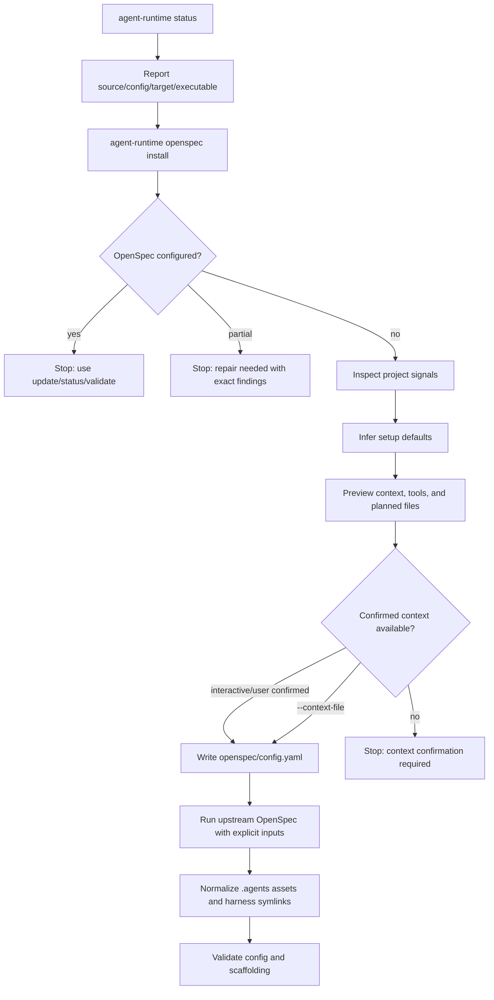

# Centralized Agent Runtime CLI And Guided OpenSpec Setup

## Goal

Make `agent-runtime` available as a globally linked CLI backed by the durable AI
repo checkout, then make `agent-runtime openspec install` and
`agent-runtime openspec update` manage repo-local OpenSpec setup through a
guided, project-aware workflow while preserving deterministic generated assets.

The global CLI should be usable from any project:

```bash
agent-runtime status
agent-runtime openspec status
agent-runtime openspec install
```

The implementation and default config come from the AI repo. The target project
is the current working directory.

`install` is first-time setup only. It should inspect the project, propose
reasonable defaults, ask the user or calling agent to confirm those defaults,
write the repo-local OpenSpec configuration, run upstream OpenSpec generation
with explicit inputs, normalize generated files, and validate the result.

`update` owns configured-project reconciliation. It should refresh generated
assets. When run with `--review-config`, it should also offer guided
configuration review when current project signals suggest better
`openspec/config.yaml` values.

## Motivation

The current runtime entrypoint is a repo-local package script:

```bash
pnpm agent-runtime ...
```

That works inside the AI repo, but it tempts agents working in other projects to
hand-roll a direct script invocation such as:

```bash
pnpm exec tsx /path/to/ai/scripts/agent-runtime.ts --config /path/to/ai/agent-runtime.config.json ...
```

That path is centralized in spirit but ad hoc in practice. A globally linked
`agent-runtime` command should make the centralized implementation intentional,
discoverable, and easy to verify.

The current OpenSpec wrapper runs:

```bash
openspec init . --tools codex,claude
```

That is deterministic for tool selection, but it bypasses the useful first-time
setup conversation and causes upstream OpenSpec to skip `openspec/config.yaml`
creation in non-interactive mode. It also inherits global OpenSpec settings for
profile, delivery, and workflows, so generated repo assets can vary by machine.

OpenSpec already supports the important repo-local project context through
`openspec/config.yaml`:

- `schema` selects the workflow schema.
- `context` gives project background to artifact-generation instructions.
- `rules` adds per-artifact constraints for `proposal`, `specs`, `design`, and
  `tasks`.

The runtime should use those existing surfaces instead of inventing a parallel
configuration model.

## Decisions

- `agent-runtime` is installed as a global command through the AI repo package
  link. The command stays in sync with source edits in the durable checkout.
- Global `agent-runtime` uses the AI repo `agent-runtime.config.json` by
  default. Per-repo config discovery is out of scope; `--config <path>` remains
  an explicit escape hatch.
- Repo-local scopes use the current working directory as the target project.
  Shared runtime scopes use the AI repo source root and central config.
- Top-level `agent-runtime status` is the read-only verification command for the
  global installation, central config, managed profiles, hooks, and the current
  target project's OpenSpec state.
- `install` runs only when the project is not configured for OpenSpec.
- A project is fully configured only when `openspec/config.yaml` exists and the
  selected managed OpenSpec assets are normalized.
- Partial setup is not silently overwritten. `install` stops with a repair
  status that names the missing or duplicated assets.
- First-time setup requires confirmed project context. Interactive agents may
  ask the user in chat and pass the confirmed result to the CLI; headless runs
  must pass `--context-file <path>`.
- `update` replaces a separate `configure` command. It owns refresh and guided
  config review for configured projects, but normal `update` remains quiet and
  asset-focused unless config review is explicitly requested.
- `update` never initializes a missing project. Missing setup points to
  `install`.
- The runtime uses upstream OpenSpec as the generator, then normalizes generated
  assets into canonical `.agents` paths.
- The runtime isolates OpenSpec global config during generation so profile,
  delivery, and workflows come from confirmed runtime inputs instead of the
  user's ambient machine state.
- Existing user-authored `openspec/config.yaml` values are preserved by default;
  proposed replacements require user confirmation.

## Domain Terms

| Term | Meaning |
| --- | --- |
| Source root | The durable AI repo checkout that contains the linked CLI implementation and central runtime config. |
| Target root | The current working directory where repo-local commands such as `openspec` inspect or mutate project files. |
| Global linked CLI | The `agent-runtime` executable installed by linking the AI repo package globally. It should resolve back to the durable source root. |
| Central config | The AI repo `agent-runtime.config.json`, used by default for global CLI invocations. |
| Configured project | A repo with `openspec/config.yaml` and normalized managed OpenSpec skill/command assets for the selected tools. |
| Partial setup | A repo with some OpenSpec directories or generated assets but missing required config or normalization. |
| Project context | The `openspec/config.yaml` `context` string injected into artifact instructions. |
| Artifact rules | The `openspec/config.yaml` `rules` entries keyed by OpenSpec artifact IDs such as `proposal`, `specs`, `design`, and `tasks`. |
| Deterministic generation | Running upstream OpenSpec with explicit tools/profile/delivery/workflows and isolated global config. |

## Plan Workflow Alignment

This plan is not implementation-ready by itself. It must go through the
review-first planning workflow before coding starts:

1. `plan-ready` emits an `openspec_blueprint` for this multi-deliverable work.
2. The configured OpenSpec propose entrypoint creates the OpenSpec change.
3. `openspec validate <change-id> --strict --no-interactive` passes.
4. `agent-runtime openspec validate` passes for repo-local scaffolding.
5. `plan-review` publishes the planning-only review artifact and emits a valid
   `planning_review`.
6. Implementation starts only after the planning-review gate allows it.

## State Model

All commands should use one shared `inspectOpenSpecState` helper that returns an
`OpenSpecStateReport`. The report must include a state, selected tools,
expected paths, found paths, path-level findings, and whether each finding is
repairable by `update`.

| State | Precedence | Example footprints | `install` | `update` | `status` / `validate` |
| --- | --- | --- | --- | --- | --- |
| `missing` | No OpenSpec footprint exists | no `openspec/`, no managed generated assets | allowed | stops and points to `install` | reports missing setup |
| `configured` | Config exists and selected managed assets are normalized | `openspec/config.yaml`, canonical `.agents` assets, expected symlinks | stops with `already_configured` | refreshes assets; config review only with `--review-config` | passes if no drift |
| `partial` | Any OpenSpec footprint exists but required invariants fail | `openspec/` without config, config-only, assets-only, wrong symlink targets, duplicated real `.codex/.claude` generated dirs, stale commands | stops with `repair_needed` | may repair generated asset drift; blocks on unsafe config ambiguity | reports exact findings |

`assets-only` is partial, not configured. `config-only` is also partial until
the expected generated assets are present and normalized. Existing
`openspec/specs` without generated runtime assets should be reported as partial
and never overwritten by `install`.

## Desired Workflow



## Command Behavior

### Global `agent-runtime`

The globally linked command is the preferred entrypoint outside the AI repo.
`pnpm agent-runtime` remains valid for developing the CLI inside the AI repo,
but the shared `agent-runtime-cli` skill should teach agents to prefer the
global command for work in arbitrary target projects.

Global invocations resolve:

- source root: the linked AI repo package root;
- config path: source root `agent-runtime.config.json`, unless `--config` is
  provided;
- target root: `process.cwd()` for repo-local scopes such as `openspec`.

The CLI should not auto-discover a target repo's `agent-runtime.config.json`.
There is no per-repo customization path in this slice.

### `agent-runtime status`

Top-level status is the global runtime installation check. It is read-only and
should report:

- source root;
- config path;
- target root;
- executable path;
- whether the global executable resolves to the durable AI checkout;
- configured profiles and their managed skill/instruction state;
- hook state;
- current target project's OpenSpec state.

Missing OpenSpec in the target project is not a broken runtime installation.
Top-level status should distinguish global runtime health from target-project
OpenSpec readiness.

### `agent-runtime openspec install`

Install is first-time setup.

1. Detect OpenSpec state:
   - missing: no config and no managed generated assets;
   - configured: config and normalized managed generated assets present;
   - partial: OpenSpec directories or generated assets are present but expected
     config/normalization is incomplete.
2. If configured, stop with a clear message:
   - use `agent-runtime openspec update` to refresh or review config;
   - use `agent-runtime openspec status` to inspect state;
   - use `agent-runtime openspec validate` for strict drift checks.
3. If partial, stop with `repair_needed` and exact missing/duplicated paths.
4. Inspect project signals:
   - `README*`;
   - `package.json`;
   - root `AGENTS.md`;
   - selected repo-local `rules/*.md`;
   - existing tool directories such as `.codex` and `.claude`;
   - existing `openspec/specs` when present;
   - relevant task runner or package manager files.
5. Infer defaults:
   - tools;
   - schema;
   - profile;
   - delivery;
   - workflows;
   - project context;
   - artifact rules.
6. Show a preview of source root, config path, target root, inferred context,
   tools, and planned files.
7. Require confirmed context before writing files:
   - in an agent conversation, the agent asks the user to confirm or edit the
     inferred context before running the mutating command;
   - in headless CLI usage, require `--context-file <path>`.
8. Without confirmed context, exit with `confirmation_required` before writing
   any files.
9. Write `openspec/config.yaml` through a staged write that can be rolled back
   if upstream generation or normalization fails.
10. Run upstream OpenSpec generation with explicit tool and profile inputs.
11. Restore or preserve the confirmed config if upstream generation rewrites it.
12. Normalize generated OpenSpec skills and commands into `.agents` and replace
   harness-local copies with relative symlinks.
13. Run validation.

### `agent-runtime openspec update`

Update is configured-project reconciliation.

1. Require configured state. If OpenSpec is missing, stop and point to
   `install`.
2. Inspect current config, generated asset state, and project signals.
3. If `--review-config` is present, infer proposed config improvements and show
   a guided review when interactive.
4. If `--review-config` is not present, do not propose context/rule changes.
5. In headless mode, `--review-config` may apply changes only with
   `--accept-config-changes`; otherwise it reports proposed changes and exits
   without mutation.
6. Preserve current config by default.
7. Apply confirmed config changes before upstream generation.
8. Run upstream `openspec update .` with deterministic runtime inputs.
9. Restore or preserve confirmed config if upstream generation rewrites it.
10. Normalize generated assets.
11. Run validation.

`update` should be quiet when generated assets are current and no config review
was requested.

## Inference Defaults

### Tools

Prefer configured repo tools from `agent-runtime.config.json` when present.
Otherwise prefer detected tool directories. For this repo, the expected default
is `codex,claude`.

### Schema

Default to `spec-driven` unless the project already has a valid
`openspec/config.yaml` schema or a project-local schema that clearly matches the
repo's planning workflow.

### Profile, Delivery, And Workflows

Use `runtime.openspec.profile`, `runtime.openspec.delivery`, and
`runtime.openspec.workflows` in `agent-runtime.config.json`. Do not reuse the
existing `agent-runtime --profile` option for OpenSpec workflow profiles; the
OpenSpec command scope currently rejects runtime profile selection.

Default to:

- `profile`: `core`
- `delivery`: `both`
- `workflows`: upstream core workflows, unless the repo config explicitly
  declares a narrower runtime policy.

Run upstream OpenSpec with a temporary `XDG_CONFIG_HOME` containing an OpenSpec
global config for `profile`, `delivery`, and `workflows` so these values do not
come from `~/.config/openspec/config.json`. `openspec init` may still pass
upstream-supported flags such as `--tools`, `--force`, and OpenSpec's own
`--profile`; `openspec update` should rely on the isolated config because the
current upstream update command does not expose delivery/workflow flags.

### Project Context

Generate a concise context block from bounded source material. It should cover:

- repo purpose;
- primary language and package manager;
- runtime command entrypoints;
- planning and delivery conventions;
- project-specific OpenSpec expectations;
- relevant verification commands.

Do not dump entire docs or rules into context. Keep generated context short,
stable, and reviewable.

The signal collector must use a deterministic allowlist:

- sorted `README*` files, capped per file;
- `package.json`;
- root `AGENTS.md`;
- selected root `rules/*.md`, capped per file;
- `openspec/specs/**/spec.md` summaries when present;
- package-manager and task-runner files needed to infer commands.

It must ignore generated assets, runtime memory/state, caches, lockfile bodies,
archives, logs, and hidden tool output that is not part of the source contract.
Fixture tests should prove inferred context is stable when unrelated docs
change.

### Artifact Rules

Default rules should be additive and artifact-specific:

- `proposal`: require explicit in-scope and out-of-scope behavior.
- `specs`: use normative requirement language and scenarios.
- `design`: capture meaningful tradeoffs and migration concerns when present.
- `tasks`: keep tasks PR-sized, ordered by dependency, and verifiable.

Rules inferred from existing repo guidance should be proposed for user
confirmation instead of silently replacing current config.

## Config Merge Rules

- If `openspec/config.yaml` is missing during install, create it from confirmed
  values.
- If `openspec/config.yaml` exists during update, preserve existing values by
  default.
- If a user skips a proposed section, leave that section absent or unchanged.
- If a user edits a section, write the edited value for the current run.
- Never replace non-empty `context` or `rules` without explicit confirmation in
  the current run.
- Do not introduce durable ownership metadata in this slice; preserve-by-default
  is the merge algorithm.
- Validate rule keys against the selected schema's artifact IDs.

## Implementation Ownership

Keep `runOpenSpec` as command orchestration. Add reusable helpers instead of
putting detection, prompting, config writes, upstream invocation, and validation
directly into the handler:

- `inspectOpenSpecState`: returns the shared `OpenSpecStateReport`.
- `collectOpenSpecProjectSignals`: reads bounded project signals.
- `inferOpenSpecDefaults`: proposes tools, schema, workflow settings, context,
  and rules from signals and config defaults.
- `reviewOpenSpecConfig`: owns the interactive review screen and injectable
  prompt interface.
- `mergeOpenSpecConfig`: applies preserve-by-default config merges.
- `buildOpenSpecInvocation`: prepares upstream arguments and isolated
  `XDG_CONFIG_HOME`.
- Existing normalization helpers continue to own `.agents` canonicalization and
  harness symlinks.

Tests should use an argv/env-recording fake OpenSpec CLI and injectable prompt
responses rather than depending on fragile real TTY behavior.

## Validation

`agent-runtime openspec validate` should check:

- OpenSpec CLI is available.
- `openspec/config.yaml` exists for configured projects.
- `schema` resolves to a built-in, user, or project-local schema.
- `context` is below OpenSpec's configured 50KB limit.
- `rules` is an object whose keys match artifact IDs for the selected schema.
- Canonical `.agents/skills/openspec-*` directories exist for resolved tools
  and workflows.
- Generated skill targets are relative symlinks to canonical `.agents`
  directories for the configured target map.
- Canonical `.agents/commands/opsx/*.md` files exist for command-capable
  resolved tools when command generation is enabled.
- Generated command files are relative symlinks to canonical `.agents` command
  files for configured command targets.

## Failure Modes

| Status | Meaning | Next step |
| --- | --- | --- |
| `global_link_invalid` | The global executable does not resolve to the durable AI checkout | Re-link the AI repo package globally |
| `already_configured` | `install` ran on a configured project | Use `update`, `status`, or `validate` |
| `repair_needed` | OpenSpec state is partial or drifted | Run `status` and repair listed paths |
| `confirmation_required` | Install lacks confirmed project context or update config review lacks accepted changes | Confirm in chat for agent-driven use or pass `--context-file` for headless install |
| `config_invalid` | Config cannot be parsed or references unknown artifacts | Fix `openspec/config.yaml` |
| `generation_failed` | Upstream OpenSpec failed | Report exact upstream command and output |
| `normalization_failed` | Generated files could not be normalized safely | Report exact path and reason |

## Implementation Slices

### 1. Global CLI Packaging And Root Resolution

Deliverable: `agent-runtime` can be globally linked from the AI repo and run
from another target project with central config and correct target-root
semantics.

Acceptance:

- `package.json` exposes an `agent-runtime` bin.
- The global command runs from outside the AI repo.
- Source root resolves to the linked AI repo checkout.
- Config path defaults to source root `agent-runtime.config.json`.
- Target root resolves to the current working directory.
- `--config <path>` still overrides the central config.
- The CLI never auto-discovers per-repo target config.

Verification:

- Integration tests for root resolution from a fixture target repo.
- A global-link verification command run from outside the AI repo.

### 2. Top-Level Runtime Status

Deliverable: `agent-runtime status` verifies the global runtime installation
and summarizes managed surfaces without mutating files.

Acceptance:

- Status prints source root, config path, target root, and executable path.
- Status reports whether the executable resolves back to the durable AI
  checkout.
- Status aggregates configured profile, instruction, skill, hook, and target
  OpenSpec state.
- Missing OpenSpec in the target project is reported as target readiness, not a
  failed global runtime installation.
- Status returns non-zero only for invalid global runtime/config state or broken
  required managed surfaces.

Verification:

- Integration tests for healthy global status.
- Integration tests where target OpenSpec is missing but global status remains
  healthy.
- Integration tests for invalid source/config/link state.

### 3. State Detection And Command Boundaries

Deliverable: shared state classification plus `install` and `update` command
guards.

Acceptance:

- A shared `OpenSpecStateReport` classifies `missing`, `configured`, and
  `partial`.
- `install` runs only for unconfigured fixture projects.
- `install` stops on configured fixture projects.
- `install` stops on partial fixture projects with path-level findings.
- `update` stops on unconfigured fixture projects and points to `install`.
- Existing OpenSpec runtime requirements/tests are updated for the changed
  `update` behavior, which no longer initializes missing scaffolding.

Verification:

- Unit tests for OpenSpec state classification, including missing, config-only,
  assets-only, wrong symlink, duplicated generated directory, stale command, and
  fully configured fixtures.
- Integration tests for `install` and `update` command boundaries.

### 4. Minimal Guided Install Config

Deliverable: first-time install proposes and confirms the minimal setup values
needed to create `openspec/config.yaml`: tools, schema, profile, delivery, and
workflows.

Acceptance:

- Agent-driven setup can accept user-confirmed inferred minimal defaults.
- Headless install fails before writing files unless `--context-file <path>` is
  present.
- `--context-file` is documented in CLI help as the non-interactive source of
  confirmed first-time OpenSpec project context.
- Missing state creates confirmed config exactly once.

Verification:

- Unit tests for minimal default inference.
- Integration tests with context-file input and stdin closed.
- YAML parse tests for generated config.

### 5. Deterministic Upstream Generation

Deliverable: install and update run upstream OpenSpec with explicit tools,
profile, delivery, and workflows, isolated from ambient global config.

Acceptance:

- `buildOpenSpecInvocation` records the exact upstream argv and env.
- Fixture runs generate the same workflows regardless of test global OpenSpec
  config.
- `--force` is passed only where required to avoid upstream config skipping or
  legacy prompts.
- Final `openspec/config.yaml` preserves confirmed values after upstream
  generation.
- Generated assets are normalized into canonical `.agents` paths.

Verification:

- Integration tests with conflicting temporary `XDG_CONFIG_HOME`.
- Tests using an argv/env-recording fake OpenSpec CLI.
- Existing OpenSpec normalization tests.

### 6. Project Context And Artifact Rule Inference

Deliverable: bounded project-signal collection and proposed context/rules for
guided config review.

Acceptance:

- Signal collection uses sorted allowlisted paths with per-source size limits.
- Generated context excludes runtime memory/state, caches, logs, archives, and
  generated assets.
- Proposed `context` and `rules` are stable in fixtures.
- Proposed non-empty replacements require confirmation in the current run.

Verification:

- Unit tests for source selection, truncation, and ignored paths.
- Snapshot-style fixture tests for stable inferred context and rules.

### 7. Update As Asset Refresh And Optional Configuration Review

Deliverable: update refreshes generated assets and offers guided config review
only when `--review-config` is provided.

Acceptance:

- Normal `update` is asset-focused and quiet when assets are current.
- `update --review-config` reviews inferred config changes before generation.
- Headless `update --review-config` reports proposed changes without mutation
  unless `--accept-config-changes` is present.
- Update preserves current config by default.
- Update applies confirmed edits.
- Update exits without changes when generated assets and config are current.

Verification:

- Integration tests for preserve, edit, and no-op update paths.
- Integration tests for `--review-config` and `--accept-config-changes`.

### 8. Validation

Deliverable: validation covers config and generated scaffolding.

Acceptance:

- Validation fails for missing config, bad schema, oversized context, unknown
  rule keys, duplicated generated directories, wrong symlink targets, and target
  map drift.
- Validation is conditional on resolved tools, delivery, workflows, skill
  targets, and command targets.

Verification:

- Unit tests for config validation.
- Integration tests for invalid fixture states.
- `agent-runtime openspec validate`.
- `pnpm test:unit`.
- `pnpm test:integration`.
- `openspec validate <change-id> --strict --no-interactive`.

### 9. Documentation And Runtime Surface Alignment

Deliverable: docs, CLI help, and runtime instructions explain the command
lifecycle.

Acceptance:

- CLI help documents global linked usage, central config defaults,
  `install --context-file`,
  `update --review-config`, and `update --accept-config-changes`.
- `AGENTS.md` documents first-time install, update reconciliation, top-level
  status, validation, generated asset paths, global linked runtime usage, and
  global OpenSpec CLI handling.
- `skills/agent-runtime-cli/SKILL.md` teaches agents to prefer global
  `agent-runtime` outside the AI repo, inspect status first, ask for project
  context confirmation before first-time OpenSpec install, and avoid ad hoc
  direct script invocations.
- `rules/command-and-tools.md` is updated only if command behavior belongs in
  shared command guidance.
- `instructions/AGENTS.md` remains unchanged unless portable user-level
  guidance truly changes.
- Runtime docs describe generated asset paths and why upstream global config is
  isolated during generation.

Verification:

- `writing-skills` review for any changed agent behavior.
- `pnpm agent-runtime instructions validate --profile personal` when managed
  instruction/rule files change.
- `pnpm agent-runtime instructions validate --profile work` when managed
  instruction/rule files change.
- Relevant runtime CLI tests.

## Out Of Scope

- Installing or updating the global `@fission-ai/openspec` package
  automatically.
- Managing OpenSpec across multiple repositories in one command.
- Per-repo `agent-runtime.config.json` discovery or customization.
- Publishing the agent-runtime package to a registry.
- Compiling a `dist` build for the global CLI.
- Creating project-local OpenSpec schemas.
- Changing upstream OpenSpec templates.
- Adding a separate `configure` command.
- Starting feature implementation from this plan before planning review is
  complete.

## Expected OpenSpec Tasks

This work is multi-deliverable and should become an OpenSpec change before
implementation.

- [ ] 1.1 Add globally linked `agent-runtime` packaging and central
      source/config/target root resolution.
- [ ] 1.2 Add read-only top-level `agent-runtime status` for global runtime
      installation verification.
- [ ] 1.3 Add OpenSpec state classification and enforce `install`/`update`
      command boundaries.
- [ ] 1.4 Add minimal guided install defaults and config writing for tools,
      schema, profile, delivery, and workflows.
- [ ] 1.5 Run upstream OpenSpec generation with isolated deterministic profile,
      delivery, and workflow settings.
- [ ] 1.6 Add bounded project-signal inference for context and artifact rules.
- [ ] 1.7 Teach `update` to refresh generated assets and review config changes
      only when explicitly requested.
- [ ] 1.8 Extend validation for repo-local config quality and generated asset
      normalization.
- [ ] 1.9 Update runtime docs, tests, and `agent-runtime-cli` skill guidance for
      global CLI usage and guided install/update lifecycle.

## Risks

- A globally linked command could point at a stale or detached checkout.
  Mitigation: top-level status reports source root and link health.
- Source/config/target roots can be confused when running outside the AI repo.
  Mitigation: status and install previews show all three roots.
- Prompt UX can become noisy if every inferred value is treated as a required
  decision. Mitigation: show one review screen and let users edit only selected
  sections.
- Generated context can become stale or too verbose. Mitigation: keep context
  concise and preserve confirmed values by default.
- Ambient OpenSpec global config can continue to leak into generation.
  Mitigation: run upstream commands with isolated config and test with
  conflicting global settings.
- Update can accidentally overwrite user-authored config. Mitigation: preserve
  non-empty values by default and require confirmation for replacements.
