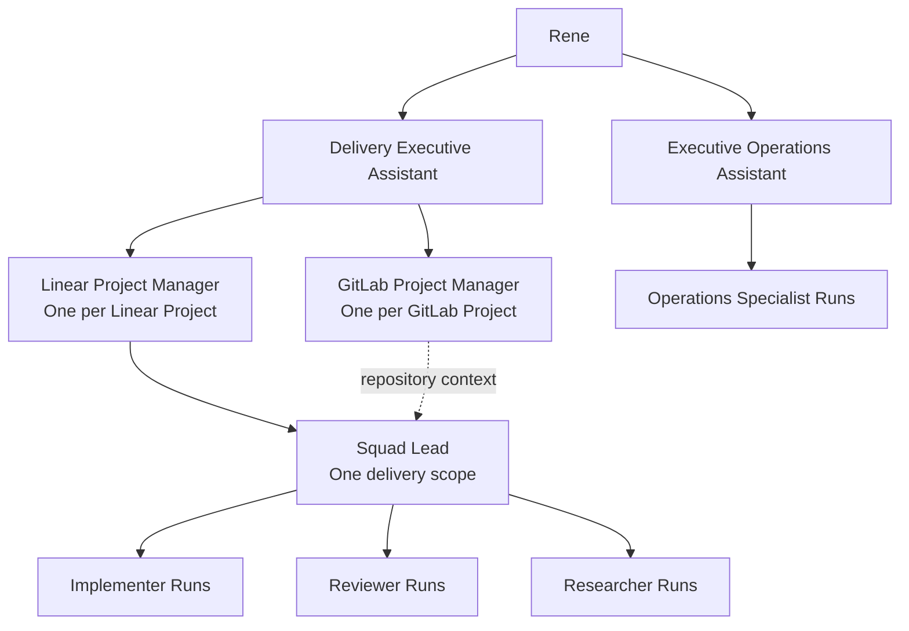

# Agent workspaces

Agent workspaces provide Rene with a durable delegation hierarchy without a
dedicated orchestration service. Linear owns coordination records, Git owns
commit history, GitLab owns hosted MRs, CI, discussions, and approvals, and
pinned Codex tasks provide the conversational surface for persistent agents.
Persistent means event-driven with durable identity; it does not mean a model
process runs continuously.

This guide is for Rene and operators who already have authenticated Linear,
GitLab, and Codex Desktop access. Use it to understand and invoke the system.
Use the linked schemas, templates, and skill when implementing or debugging the
protocol.

## Organization



The two executive assistants are Rene's normal entrypoints:

- The Delivery Executive Assistant coordinates the software-delivery
  portfolio, resolves cross-project priority, and routes work to managers.
- The Executive Operations Assistant tracks calendar, email, Slack, and
  follow-up commitments. It reads and drafts; Rene authorizes every external
  mutation or send.

A Linear Project Manager owns one Linear Project outcome, including milestones,
delivery scopes, and cross-repository dependency eligibility. A GitLab Project
Manager owns repository policy, coherence, and live GitLab context for one
GitLab Project. A Squad Lead owns implementation and delivery decisions for one
scope and consults each affected GitLab Project Manager for repository-specific
constraints.

The two executive assistants, both manager types, and Squad Leads are pinned:
each keeps one persistent Codex task. Implementers, reviewers,
researchers, and operations specialists are ephemeral Agent Runs. A Squad Lead
may end when its delivery scope closes even though it can remain active for
months.

Pinned tasks run in two generated saved Codex projects. Delivery coordinators
run under `agent-control/delivery`; the Executive Operations Assistant runs
under `agent-control/operations`. Their project-local read-only permissions and
tool-policy hooks form the mechanical authority boundary. Ephemeral agents keep
using generated Codex custom-agent descriptors.

## Durable state

Every pinned workspace uses schema-defined Linear record conventions. These are
ordinary Linear issues and sub-issues created from tracked templates with
explicit record, role, domain, and attention labels; they are not native Linear
issue types.

| Record | Purpose |
| --- | --- |
| Root Agent Record | Stable identity, scope, task ID, generation, activation state, and prompt fingerprint |
| Current Memory Epoch | Current compact memory with links to canonical evidence |
| Workstream | One active, blocked, waiting, complete, or canceled delivery scope |
| Agent Run | One ephemeral delegation, created before the agent is spawned |
| Decision | A requested or completed decision with a fingerprint and reference to authenticated approval evidence when required |
| Escalation | Blocked, urgent, or waiting-on-Rene attention with impact and next action |

An agent can use more than one issue. Use the Root as the stable index, roll
memory into numbered epochs, and create Workstream, Run, Decision, and
Escalation sub-issues as needed. Do not copy full email, Slack, attachment, or
restricted-source bodies into Linear. Store redacted summaries, identifiers,
decisions, and evidence links.

Before dispatch, the Agent Workspace serializer validates each record against
the generated schemas and role-policy projection. For `restricted` records, it
sends only opaque identity, state, timestamps, authorized source links, and an
explicit redaction notice. Free-text fields do not enter dynamic agent context.

Root points to exactly one Current Memory Epoch. Older epochs remain linked as
immutable history. A Workstream is the durable record for one delivery scope;
its Agent Runs are bounded attempts within that scope. A mutable Decision body
never makes approval immutable. Store the exact action fingerprint and a
reference to authenticated, time-bounded approval captured by the active
provider policy.

## Invoke an agent

In Codex Desktop, open the pinned Delivery Executive Assistant or Executive
Operations Assistant task and send a normal message. From another local task,
invoke the `agent-workspace` skill with `open` plus the role and scope; it finds
the Root Agent Record and navigates to the exact task ID. A missing or duplicate
Root/task identity blocks navigation.

Talk to the Delivery Executive Assistant for normal delivery work. Typical
requests are:

```text
Start the Linear Project <project name>.
Start planning <feature> in <Linear Project>.
What should I work on next across active delivery work?
Ask the GitLab Project Manager for <repository> to assess this dependency.
Open the Squad Lead for <delivery scope>.
```

Talk to the Executive Operations Assistant for operational coordination:

```text
Review today's commitments and draft the follow-ups I owe.
Prepare a proposed calendar change for my approval.
Find the Slack and email threads that need a response.
```

Use the Delivery Executive Assistant as the default route to another delivery
agent. Direct contact remains available through `agent-workspace open`. Direct
user messages after `open` remain authenticated user input. Agent-to-agent
`message` operations use the correlated invocation envelope and reporting line;
the envelope carries message and correlation IDs so retries remain one logical
assignment.

## Activate a pinned workspace

Ask an active Delivery Executive Assistant to activate a manager or invoke the
`agent-workspace` skill from a local Codex task. The skill performs the provider
writes; these are not manual API steps.

Before the first activation, synchronize both coordinator projects from clean
merged `main`, add each exact child directory as a trusted saved Codex project,
and record the two IDs with `ax coordinators register`. Missing, stale, or
ambiguous registration blocks before any Linear or task write.

Bootstrap the first assistants in this order:

1. From a trusted local Codex task where the synchronized `agent-workspace`
   skill is available, run `ax coordinators validate` and resolve both exact
   ID-to-path associations with the Codex app `list_projects` tool.
2. Rene sends this explicit request in that same task:

   ```text
   Use $agent-workspace activate to create the Delivery Executive Assistant.
   Stable key: rene:delivery-portfolio.
   Owned scope: Rene's global software-delivery portfolio.
   Reporting line: rene.
   Use the AX-registered Delivery Coordination project and stop before any write
   if its path, trust, source fingerprint, permission profile, policy hash, or
   task-tool surface cannot be verified.
   ```

3. Rene designates that task as the only bootstrap attempt and starts no other
   activation concurrently. Before any Root write, the task creates or reads a
   typed Decision keyed `control-plane:activation-writer` in the personal
   control project. It stores the bootstrap task ID and workspace generation;
   a different or duplicate claim blocks. After the Delivery Executive
   Assistant reaches `active`, persist a transfer Decision naming its task ID
   and increment the workspace generation.
4. Rene asks the active Delivery Executive Assistant:

   ```text
   Use $agent-workspace activate to create the Executive Operations Assistant.
   Stable key: rene:executive-operations.
   Owned scope: Rene's calendar, email, Slack, and follow-up coordination.
   Reporting line: rene.
   Use the AX-registered Executive Operations project.
   ```

Every later activation routes through the recorded Delivery Executive
Assistant writer. A local task may request or forward activation, but cannot
perform the writes after the transfer.

Activation is idempotent. The stable key is the canonical Linear Project ID,
canonical GitLab
Project ID, or Linear Project plus delivery-scope key.

The two bootstrap keys are fixed above. A Squad Lead key is
`<linear-project-id>:<delivery-scope-key>`; the Linear Project Manager allocates
one lowercase kebab-case scope key and reuses it for every retry.

1. Search for an existing Root Agent Record with the stable key.
2. Create the Root in `reserved` and create its Current Memory Epoch.
3. Resolve the role's control-project kind, unique saved project ID/path,
   current trust, source fingerprint, permission profile, and policy hash.
   Verify the generated prompt bundle, required tools, and prohibited mutation
   surfaces.
4. Persist `task_pending` with the role, stable key, nonce, scope, reporting
   line, generation, contract version, prompt hash, control-project kind, ID,
   exact path, control-policy hash, source fingerprint, and permission profile.
   Re-read all writer, generation, project, trust, and policy evidence
   immediately before `create_thread`. Supply the immutable tuple plus the exact
   pinned prompt bundle path/hash as the initial `pre_create` prompt with the
   registered saved project ID. The project contract loads the bundle, and the
   new task may reply only `PENDING_CONTEXT`.
5. Persist and read back the returned Codex task ID.
6. Read and verify the sole `PENDING_CONTEXT` response, then pin the task.
7. Send the complete `post_create` context as the first follow-up, persist and
   read back the task's full attestation, then mark the Root `active`.

If task creation succeeds but persisting its ID fails, preserve the task and
Root in `task_pending`. Recovery lists Codex tasks and reads their initial
creation prompts. Adopt exactly one task only when trusted creation provenance
and the complete tuple match the Root. Creation provenance includes the creator
task, exact saved project ID/path, creation response, initial prompt tuple,
prompt-bundle hash, and task creation time. Zero, multiple, stale-registration,
or mismatched candidates block recovery. Never create a replacement to hide a
partial transition.

Resume always starts from the first incomplete state in the recorded sequence:
reconcile task ID, verify `PENDING_CONTEXT`, pin, deliver `post_create`, persist
and read back the complete attestation, then mark `active`. A task or Root that
is ahead of the other is repaired forward only after the exact task, project,
generation, prompt, source, permission, and policy identities still match. If a
coordinator sync invalidates registration during recovery, re-register and
revalidate first; a changed immutable tuple blocks orphan adoption rather than
creating a replacement. Record a blocked Escalation. Rene may then authorize
deactivation and archival of that exact orphan: mark the Root `inactive`,
increment generation, preserve its history, archive the verified task, and
reactivate the same stable Root under the new tuple.

## Delegate implementation

Create an Agent Run in `reserved` before spawning any ephemeral agent. Include
the objective, lifecycle mode, authority, canonical sources, acceptance,
verification, stop condition, escalation route, model profile, workspace
generation, and next check time.

For parallel delivery, the Squad Lead records one total Git predecessor order,
semantic eligibility, integration hotspots, and one writer per worktree. It may
run independent implementation units concurrently. A separate reviewer Run
inspects each exact artifact; the writer never reviews its own artifact. Every
head or target-base change invalidates prior review evidence.

Finish may publish technically ready draft MRs and follow CI and hosted review
when repository policy allows it. Green CI, approval, urgency, or the word
`proceed` never grants merge authority. Rene must merge or explicitly grant
merge authority for the exact action.

## Models and reasoning

Route each new delegation independently and start with the lowest adequate
profile. Pinned agents also re-evaluate their profile when the task shape or
risk changes:

| Work | Default | Automatic escalation |
| --- | --- | --- |
| Pinned delivery coordination | Sol, medium | Sol high, then xhigh |
| Routine operations coordination | Terra, low | Sol medium, then high |
| Implementation | Terra, low | Escalate from evidence and risk |
| Standard review | Sol, low | Sol high for high-risk review |
| Bounded research | Luna, medium | Sol medium when synthesis requires it |

Sol, Terra, and Luna are model-family aliases defined by the tracked manifest;
low through xhigh are reasoning levels. Max and Ultra are manual-only. Never
inherit an escalated profile into a later Run without new evidence.

## Escalation and wakeups

Use `BLOCKED` when progress needs authority, information, ownership,
credentials, or a material decision. Use `URGENT` only when delay has a concrete
delivery, operational, security, or customer cost. Include impact, evidence,
attempted mitigation, required action, owner, and deadline.

Pinned agents checkpoint concise state and set an RFC 3339 `next_check_at`; they
do not busy-poll. In the initial runtime, that value records the requested
wakeup for the coordinating task or user; it is not an autonomous scheduler.
An automation may later consume it, but activation must not assume one exists.
Completion closes the Workstream that represents a delivery scope. It does not
archive the pinned workspace. Deactivation and archival require Rene or an
exact active lifecycle policy.

## Contract vocabulary

| Term | Meaning |
| --- | --- |
| Workspace generation | Monotonic fencing value; stale generations may report but cannot mutate |
| Prompt fingerprint | SHA-256 of role identity, charter, reporting line, capabilities, required skills, model profile, sandbox, overlays, and rendered prompt body |
| Control policy fingerprint | SHA-256 of the generated logical tool allow/deny policy bound into activation and invocation |
| Control source fingerprint | SHA-256 of the complete generated project inventory, including permission config, hook registration and source, prompts, and instructions |
| Activation nonce | Retry correlation value, not authentication |
| Attestation | Persisted ACK of role, scope, reporting line, prompt, saved project, source fingerprint, permission profile, tools, policy, and generation |
| Canonical source | Authoritative Linear, Git, GitLab, or operations record linked by ID |
| Exact artifact | Source HEAD plus resolved target-base identity reviewed together |
| Git predecessor order | Total order of related changes within a repository; it does not create ancestry across repositories |
| Semantic eligibility | Whether a unit can start based on accepted contracts and dependencies |
| Integration hotspot | File, API, schema, or behavior where parallel units may conflict |

The public lifecycle modes are Explore, Plan, Execute, Review, and Finish.
Finish owns permitted provider publication and follow-through; it does not imply
merge.

## See also

- [AX CLI](ax.md)
- [Agent manifest](../agents/manifest.json)
- [Activation schema](../agents/schemas/activation-context.schema.json)
- [Invocation envelope schema](../agents/schemas/invocation-envelope.schema.json)
- [Workspace record schema](../agents/schemas/workspace-record.schema.json)
- [Linear record templates](../agents/templates/linear/root-agent-record.md)
- [Five-mode repository instructions](../AGENTS.md)
- [Agent workspace skill](../skills/agent-workspace/SKILL.md)
