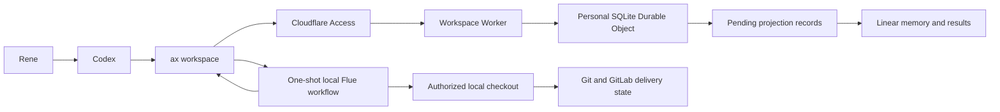
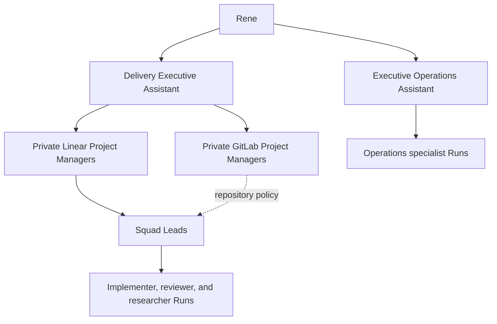

# Agent workspaces

Agent workspaces preserve Rene's organizational hierarchy while keeping Codex
as the only user interface. Cloudflare holds authoritative operational state.
Flue executes one queued operation at a time on Rene's local machine. Linear
receives durable memory and result projections.

This first cut does not deploy model execution, shells, repositories, or
sandboxes to Cloudflare. Remote clients still control the local Codex host, so
the current checkout and local approvals remain the execution boundary.

## Architecture



The Durable Object owns bootstrap state, agent generations, inbox messages,
operations, typed records, results, and projection acknowledgements. Git and
GitLab remain authoritative for commits, branches, merge requests, pipelines,
and hosted review. Rene authorizes merge, deployment, cleanup, and external
provider actions unless an exact active policy grants them.

The hierarchy remains:



Rene sends normal delivery work to the Delivery Executive Assistant. Durable
agents delegate by returning messages to stable agent keys. The private
managers remain part of the model without requiring separate user-facing Codex
tasks.

## Durable records

The control plane keeps the existing six record types:

| Record | Purpose |
| --- | --- |
| Root | Stable agent identity, reporting line, generation, backend, and prompt metadata |
| Memory | Compact current charter, constraints, decisions, and active Workstreams |
| Workstream | One active, blocked, waiting, complete, or canceled outcome |
| Run | One bounded execution attempt with authority and verification |
| Decision | A requested or completed material decision and its evidence |
| Escalation | Blocked, urgent, or waiting-on-Rene attention |

Cloudflare stores normalized JSON and SQLite indexes. Restricted records expose
only identity and an explicit redaction notice to the local runner. The runner
must open an authorized canonical source before using restricted content.

Every operation includes a workspace generation. Completion fails when that
generation no longer matches the target agent. This prevents a stale local
process from mutating state after an authority change.
Create the operation and its Agent Run record before executing ephemeral work.

## Configure access

Deployments must sit behind Cloudflare Access. Configure the Worker with
`AX_ACCESS_TEAM_DOMAIN` and `AX_ACCESS_AUD`. AX authenticates with a service
token supplied only through the environment:

```bash
export AX_WORKSPACE_ACCESS_CLIENT_ID=<service-token-id>
export AX_WORKSPACE_ACCESS_CLIENT_SECRET=<service-token-secret>
ax workspace configure --url https://<worker-host> --workspace rene
```

The Worker validates the Access JWT issuer, audience, `RS256` algorithm,
signature, activation time, and expiry. An explicit development token works
only when `AX_WORKSPACE_ENVIRONMENT` is not `production`.

## Bootstrap

Create a fresh workspace from the tracked Delivery and Operations executive
roles:

```bash
ax workspace bootstrap
ax workspace status --json
```

Bootstrap writes two Roots, their initial Memory epochs, and completed bootstrap
Workstreams in one Durable Object transaction. It does not export or copy
existing Linear state into those records. Agents may still read Linear issues
and projects as canonical work context. Later manager Roots are Cloudflare-native
record mutations and become routable as soon as their result is accepted.

## Send and run work

Queue ordinary work for the executive agent:

```bash
ax workspace send --message "Summarize the active delivery portfolio."
export AX_FLUE_MODEL=<provider/model>
ax workspace run --once
```

Queue repository work only with explicit local authority:

```bash
ax workspace send \
  --message "Implement the accepted change and run its verification." \
  --repo /absolute/path/to/repository \
  --workspace-write
AX_FLUE_MODEL=<provider/model> ax workspace run --once
```

`run --once` checks model configuration before claiming an operation. It then
loads the target Root and linked records, invokes the tracked Flue workflow, and
submits a schema-validated result. Read-only operations use Flue's virtual
workspace. Explicit `workspace-write` operations use Flue's trusted-host local
adapter with the recorded repository path as cwd. That adapter can reach the
host and is not an isolation boundary. AX passes a narrow child-process
environment, and Cloudflare receives neither repository bytes nor model
credentials.

Durable coordinators remain read-only. A write-capable request grants them
authority to create a bounded Run; the derived ephemeral Run receives the local
adapter, worktree cwd, acceptance, verification, and stop condition.

`AX_FLUE_MODEL` is the required fallback. A normalized profile override such as
`AX_FLUE_MODEL_HIGH_RISK_REVIEW` takes precedence for operations routed to that
model profile.

The first cut has no daemon, timer, autonomous scheduler, or remote execution.
Run the command again to process the next message. A failed Flue process records
a failed result so the queue does not retain a false running state.

## Linear integration output

Linear is the workspace's integration output for durable memory and results.

Export unacknowledged outputs:

```bash
ax workspace linear export --json
```

Write those projections through the authenticated Linear surface. Project
Memory, Decision, Escalation, completed Workstream/Run records, and operation
results. After each successful provider write, acknowledge its projection ID:

```bash
ax workspace linear acknowledge --file projection-ids.json
```

Acknowledgement is not a provider write. It records that a separate Linear
write succeeded. Failed writes remain exportable and retryable.

## Agentic Inbox assessment

[Cloudflare Agentic Inbox](https://github.com/cloudflare/agentic-inbox) is a
useful reference, not a dependency for this cut. It demonstrates one SQLite
Durable Object per coordination atom, explicit migrations, fail-closed
Cloudflare Access, persistent history, and confirmation before outbound send.

Its product boundary does not match this workspace. Agentic Inbox is an email
client built around Email Routing, R2 attachments, a React interface, Workers
AI, and Cloudflare-hosted agent execution. Importing or forking it would add a
second interface and move model work away from the local machine. A future
Executive Operations email adapter can reuse its mailbox and confirmation
ideas without adopting its runtime or UI.

## Command reference

| Command | Use |
| --- | --- |
| `ax workspace configure` | Save endpoint and personal workspace key |
| `ax workspace bootstrap` | Create the fresh executive hierarchy |
| `ax workspace status` | Inspect bootstrap state, queues, records, and projections |
| `ax workspace send` | Queue an executive or direct-agent message |
| `ax workspace run --once` | Execute at most one operation locally |
| `ax workspace records list` | List authoritative records, optionally by type |
| `ax workspace records show` | Read one authoritative record |
| `ax workspace linear export` | Read pending Linear integration output |
| `ax workspace linear acknowledge` | Mark successful projection writes |

## See also

- [AX CLI](ax.md)
- [Agent manifest](../agents/manifest.json)
- [Workspace record schema](../agents/schemas/workspace-record.schema.json)
- [Workspace operation schema](../agents/schemas/workspace-operation.schema.json)
- [Workspace result schema](../agents/schemas/workspace-result.schema.json)
- [Agent workspace skill](../skills/agent-workspace/SKILL.md)
