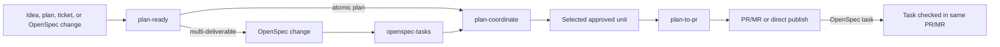

# OpenSpec Delivery Coordination

## Goal

Replace the current slice-ledger planning workflow with a simpler delivery model:

- `plan-ready` decides whether work is atomic or needs OpenSpec.
- `openspec-tasks` audits OpenSpec checkbox tasks as minor deliverables.
- `plan-coordinate` becomes the single delivery coordinator entry point.
- `plan-to-pr` implements exactly one approved unit.
- OpenSpec `tasks.md` is the only durable multi-step ledger.

The implementation should remove the old `slice_plan_review`,
`reviewed_slices`, and followthrough-ledger contracts. Old threads must rerun
`plan-ready`; no backwards compatibility path is required.

## Motivation

The current workflow duplicates OpenSpec responsibilities. `plan-slices`
creates or audits slices, `plan-ready` validates a slice review, and
`plan-followthrough` maintains a separate ledger. That spreads one planning
state across multiple agent-specific artifacts.

OpenSpec already has the right durable shape for multi-step work:

- `proposal.md` explains the milestone or project.
- `design.md` explains the technical approach when needed.
- `specs/**/spec.md` defines behavioral requirements.
- `tasks.md` is the delivery queue.

The new workflow should use that native shape. For one-off atomic plans, no
ledger is needed. For multi-deliverable work, OpenSpec owns the plan and task
progress.

## Desired Workflow



## Skill Responsibilities

### `plan-ready`

`plan-ready` is a readiness router.

It validates whether the planning input can be delivered as one atomic unit. An
atomic plan must have:

- one user or system outcome;
- one primary ownership area;
- no required sequencing across multiple PRs or MRs;
- one verification story;
- no hidden migration, deployment, or manual prerequisite chain.

If the plan is atomic, `plan-ready` emits a ready handoff for
`plan-coordinate`. If the plan is multi-deliverable, `plan-ready` returns
`needs_openspec` and stops. It must not create synthetic slices or emit
`slice_plan_review`.

### `openspec-tasks`

`openspec-tasks` audits `openspec/changes/<change-id>/tasks.md`.

Each checkbox task must map to one minor deliverable inside the feature
milestone or project. A task can include indented notes for files, acceptance
criteria, or verification, but those notes are not separate delivery units.

The audit checks:

- checkbox format follows OpenSpec task conventions;
- tasks are ordered by dependency;
- each implementation task fits one delivery loop;
- manual, deployment, monitoring, and external-prerequisite tasks are
  distinguishable from implementation tasks;
- the first unchecked implementation task is not a broad phase or hidden
  multi-task bundle.

`openspec-tasks` may recommend edits to `tasks.md`, but it does not maintain
separate state.

### `plan-coordinate`

`plan-coordinate` is the single coordinator entry point.

For an atomic plan, it validates the new `plan_coordinate_handoff`, calls
`plan-to-pr` for one delivery, reports the delivery result, and stops.

For an OpenSpec change, it validates OpenSpec with:

```bash
openspec validate <change-id> --strict --no-interactive
```

Then it resolves the repo's delivery target branch and publishing remote,
refreshes that target, records the target commit used for task selection, reads
`tasks.md` from that refreshed target state, selects the first unchecked
deliverable task in document order, and calls `plan-to-pr` for that task.

`plan-coordinate` does not keep a ledger. It advances from target-branch
OpenSpec state only. An open PR/MR branch can have a task checked, but the
coordinator does not treat that task as complete until the branch is merged or
directly published according to repo policy.

If the target branch cannot be identified, cannot be refreshed, or changes
between task selection and delivery start, `plan-coordinate` must stop with
`selected_task_stale` or `needs_plan_ready`. It must not select work from a
detached checkout, stale local branch, or in-progress PR/MR branch without
comparing that state to the recorded target commit.

### `plan-to-pr`

`plan-to-pr` implements exactly one approved unit:

- one atomic plan;
- or one OpenSpec checkbox task.

For OpenSpec tasks, `plan-to-pr` must check the task from `[ ]` to `[x]` in the
same PR/MR that implements the task. It must not create a follow-up bookkeeping
commit for task completion.

`plan-to-pr` blocks if implementation requires broadening the approved unit,
editing unrelated OpenSpec tasks, or adding new OpenSpec tasks.

## New Handoff Contract

The old `slice_plan_review`, `reviewed_slices`, and
`plan_followthrough_slice_handoff` shapes are removed.

`plan-ready` and `plan-coordinate` exchange one route-specific handoff:

```yaml
plan_coordinate_handoff:
  status: ready
  route: atomic_plan | openspec_task
  artifact:
    type: plan | openspec
    ref: docs/plans/example.md | openspec/changes/change-id
    fingerprint: <sha256 or current commit sha>
  approved_unit:
    id: atomic | "1.2"
    title: <short title>
    scope: <one paragraph>
    acceptance:
      - <observable result>
    verification:
      - <required command, check, or manual proof>
  constraints:
    files_or_areas:
      - <expected ownership area>
    out_of_scope:
      - <explicit non-goal>
  delivery:
    expected_host: github_pr | gitlab_mr | direct_publish
    completion_updates:
      - <for openspec_task: mark task checkbox complete in same PR/MR>
  review:
    required_reviewers:
      - implementation-readiness
      - edge-cases-and-risks
      - simplification-and-scope-control
      - refactoring-opportunities
    optional_reviewers: []
  blockers: []
```

## Failure Routing

Every skill returns a mechanical failure route:

| Status | Meaning | Next step |
| --- | --- | --- |
| `needs_plan_ready` | Input is stale, fuzzy, or legacy-shaped | Rerun `plan-ready` |
| `needs_openspec` | Work is multi-deliverable | Create or update OpenSpec |
| `openspec_invalid` | OpenSpec validation fails | Repair OpenSpec |
| `needs_openspec_tasks` | `tasks.md` is not deliverable | Run `openspec-tasks` and edit tasks |
| `selected_task_stale` | Target branch changed task state | Rerun `plan-coordinate` |
| `implementation_scope_escape` | Approved unit is too small or wrong | Return to OpenSpec or `plan-ready` |
| `delivery_blocked` | Execution failed inside approved scope | Stay in `plan-to-pr` |
| `needs_human_action` | Manual or external prerequisite blocks progress | Pause with evidence |

Planning failures move backward. Delivery failures stay local unless they prove
the approved unit is wrong.

## Implementation Tasks

This work is multi-deliverable. It should be represented as an OpenSpec change
before implementation. The task list below describes the expected OpenSpec
`tasks.md` shape.

## 1. Rename and Contract Surface

- [ ] 1.1 Replace `plan-followthrough` skill documentation with
  `plan-coordinate` responsibilities.
- [ ] 1.2 Replace `plan-followthrough` adapter prompt metadata with
  `plan-coordinate` invocation guidance.
- [ ] 1.3 Rename or replace the `plan-followthrough` helper script entry points
  with `plan-coordinate` route validation commands.
- [ ] 1.4 Replace `plan-slices` skill documentation with `openspec-tasks`
  responsibilities.
- [ ] 1.5 Replace `plan-slices` adapter prompt metadata with `openspec-tasks`
  audit guidance.
- [ ] 1.6 Rename or replace the `plan-slices` helper script entry points with
  `openspec-tasks` task-audit commands.
- [ ] 1.7 Update discoverability surfaces so the available skill list exposes
  `plan-coordinate` and `openspec-tasks`: skill folder names, `SKILL.md`
  `name` fields, `agents/openai.yaml` display metadata, adapter prompts, and
  installed runtime skill listings.

## 2. Plan-Ready Atomicity Route

- [ ] 2.1 Update `plan-ready` documentation and adapter prompt to make atomic
  vs OpenSpec-required routing the first readiness gate.
- [ ] 2.2 Update `plan-ready` helper validation to emit and validate
  `plan_coordinate_handoff` for atomic plans.
- [ ] 2.3 Reject legacy `slice_plan_review`, `reviewed_slices`, and
  `plan_followthrough_slice_handoff` inputs in `plan-ready` with
  `needs_plan_ready`.

## 3. OpenSpec Task Audit

- [ ] 3.1 Add a Markdown checkbox parser that returns task id, title, checked
  state, line number, and parent heading.
- [ ] 3.2 Validate that each OpenSpec checkbox task maps to one minor
  deliverable and that broad phase tasks block delivery.
- [ ] 3.3 Classify manual, deployment, monitoring, and external-prerequisite
  tasks so the coordinator pauses with `needs_human_action` instead of sending
  them to `plan-to-pr`.

## 4. Coordinator Delivery Route

- [ ] 4.1 Teach `plan-coordinate` to consume atomic `plan_coordinate_handoff`
  inputs and invoke the one-unit delivery path.
- [ ] 4.2 Teach `plan-coordinate` to resolve the repo policy target branch and
  publishing remote, refresh the target branch, and record the target commit
  used for OpenSpec task selection.
- [ ] 4.3 Teach `plan-coordinate` to validate OpenSpec changes, read
  target-branch `tasks.md` from the recorded target commit, and select the first
  unchecked deliverable task.
- [ ] 4.4 Ensure coordinator completion is based on target-branch state after
  merge or direct publish, not open PR/MR branch state.
- [ ] 4.5 Add stale-state handling when the selected task is already complete,
  missing, or changed on the refreshed target branch before delivery starts.
- [ ] 4.6 Reject legacy `plan_ready_handoff`,
  `plan_followthrough_slice_handoff`, `reviewed_slices`, and
  followthrough-ledger inputs in `plan-coordinate` with `needs_plan_ready`.

## 5. Plan-To-PR Unit Execution

- [ ] 5.1 Update `plan-to-pr` to accept one approved atomic unit or one
  OpenSpec checkbox task.
- [ ] 5.2 Require OpenSpec task checkbox completion in the same PR/MR as the
  implementation.
- [ ] 5.3 Block implementation when the selected unit requires unrelated task
  edits, new tasks, or broadening the approved scope.
- [ ] 5.4 Reject legacy direct `plan_ready_handoff`,
  `plan_followthrough_slice_handoff`, `reviewed_slices`, and delivery-ledger
  inputs in `plan-to-pr` with `needs_plan_ready`.

## 6. Plan-To-Review Alignment

- [ ] 6.1 Update `plan-to-review` documentation so planning-only review accepts
  OpenSpec changes and new coordinator handoffs, not legacy `reviewed_slices`.
- [ ] 6.2 Update `plan-to-review` adapter prompt metadata to remove
  `reviewed_slices` as upfront slice-plan evidence.
- [ ] 6.3 Update `plan-to-review` helper validation and tests to reject legacy
  `plan_ready_handoff.reviewed_slices` inputs and accept the new route shape.

## 7. Tests and Runtime Refresh

- [ ] 7.1 Replace unit tests for `slice_plan_review`, `reviewed_slices`, and
  followthrough ledgers with tests for the new handoff and route statuses.
- [ ] 7.2 Add OpenSpec task parser and coordinator selection tests using Nitro
  style `tasks.md` fixtures.
- [ ] 7.3 Add coordinator tests for detached worktrees, stale local target
  branches, checked OpenSpec tasks on open PR/MR branches, and target-branch
  changes between task selection and delivery start.
- [ ] 7.4 Run repo tests and refresh installed runtime skill copies for the
  configured `personal` and `work` profiles with
  `pnpm agent-runtime skills update --profile personal` and
  `pnpm agent-runtime skills update --profile work`.
- [ ] 7.5 Confirm the active runtime surface with
  `pnpm agent-runtime skills status --profile personal` and
  `pnpm agent-runtime skills status --profile work`, or with a repo-supported
  all-profile validation command. Record generated runtime lock or managed
  artifact changes.

## Non-Goals

- Do not preserve backwards compatibility for old handoff shapes.
- Do not add task tags or schema extensions to OpenSpec.
- Do not create a separate ledger file.
- Do not mark OpenSpec tasks complete in follow-up bookkeeping commits.
- Do not teach `plan-to-pr` to manage the full OpenSpec sequence.
- Do not implement delivery behavior while this plan is only being reviewed.

## Readiness Assessment

This plan is not atomic. It touches skill names, adapter prompts, helper
scripts, tests, runtime install behavior, and delivery contracts. Under the new
workflow it should route to OpenSpec before implementation.

`plan-ready` verdict for this artifact:

```yaml
plan_ready_result:
  status: needs_openspec
  artifact_type: plan
  artifact_ref: docs/plans/openspec-delivery-coordinate.md
  reason: The change contains multiple independently reviewable deliverables and
    must be represented as an OpenSpec change before delivery.
  recommended_next_action: Create an OpenSpec change whose tasks.md uses the
    implementation tasks in this plan as one-checkbox-per-deliverable work.
```
