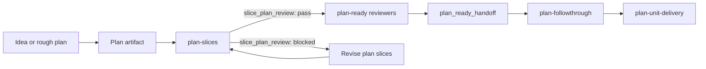

# Plan Slices Skill

## Goal

Add a mandatory `plan-slices` workflow that turns large plans into deliverable
implementation slices and audits existing sliced plans before `plan-ready`
emits a handoff.

The first implementation must create a standalone `plan-slices` skill and make
`plan-ready` require a current passing `slice_plan_review` before reviewer
selection and `plan_ready_handoff` generation.

## Motivation

The current workflow has strong boundaries after a plan is ready:

- `plan-ready` hardens the planning artifact and emits a reviewed handoff.
- `plan-followthrough` tracks slice continuity and ledger state.
- `plan-unit-delivery` delivers one approved slice through local verification, reviewer
  gates, hosted feedback, and CI.

The weak point sits before `plan-ready` hands off to delivery. A large plan can
enter readiness review with slices that are too broad, too foundational, poorly
ordered, or missing verification boundaries. That pushes slicing corrections
into review or implementation, where they create churn.

`plan-slices` should make slice quality explicit before readiness review. It
should support two workflows:

1. Create implementation slices from a large plan.
2. Audit an existing sliced plan for delivery fit.

Single-slice plans are not exempt. When a plan has one implementation slice, or
when a plan has no stable slice IDs yet, `plan-slices` audits it in `mode:
audit` and synthesizes `slice-01` for the review block.

## Workflow Position



`plan-slices` does not replace `plan-ready`. It produces a slice-quality gate
that `plan-ready` consumes.

## Scope

Implement the first usable version:

- Add `skills/plan-slices/SKILL.md`.
- Add `skills/plan-slices/agents/openai.yaml`.
- Add `skills/plan-slices/scripts/plan-slices.ts`.
- Add focused unit tests for `plan-slices` templates and validation.
- Update `skills/plan-ready/SKILL.md` so `plan-slices` is mandatory before
  reviewer selection.
- Update `skills/plan-ready/agents/openai.yaml` with the new mandatory gate.
- Update `skills/plan-ready/scripts/plan-ready.ts` so handoff validation can
  require or verify a passing `slice_plan_review`.
- Update the `handoff-template` command in
  `skills/plan-ready/scripts/plan-ready.ts` so generated examples include the
  required `slice_plan_review` companion block.
- Update `tests/unit/plan-ready-script.test.ts` for the new enforcement.
- Run the repo-managed skill install or update path for the intended profile,
  prefer `pnpm agent-runtime skills install --profile personal`, record any
  `agent-runtime.lock.json` change, and verify with the matching
  `agent-runtime` status and validation commands.
- Update runtime or docs surfaces only when needed for discoverability.

## Non-Goals

- Do not start implementation delivery in this plan.
- Do not create a hosted service, persistent state store, dashboard, or artifact
  registry.
- Do not create a generic project-management model or provider-neutral adapter.
- Do not move `plan-followthrough` responsibilities into `plan-slices`.
- Do not require `plan-slices` to run hosted PR/MR review or CI.
- Do not make `plan-slices` choose `ship_then_continue` or
  `stack_then_continue`.

## Skill Contract

Use `plan-slices` when a plan needs implementation slices or when an existing
sliced plan needs a slice-quality audit before `plan-ready`.

The skill must check every implementation slice against six gates:

| Gate | Requirement |
| --- | --- |
| Observable outcome | The slice names the real entrypoint, operation, and visible result. |
| Bounded scope | The slice has a small primary ownership area and excludes unrelated cleanup. |
| Sequencing | Prerequisites, dependencies, and later consumers are explicit. |
| Verification | The slice names the fastest durable verification layer and accepted gaps. |
| Refactoring / Reuse | The slice includes the `plan-ready` refactoring subsection or says `None`. |
| Delivery fit | The slice fits one `plan-unit-delivery` delivery loop without absorbing follow-up work. |

The skill can edit or propose edits to the plan artifact, depending on the
surrounding workflow and user instruction. When used by `plan-ready`, it should
leave a machine-checkable review block in the session and keep handoff state out
of committed plan files.

## Review Contract

`plan-slices` emits this review shape:

```yaml
slice_plan_review:
  status: pass | blocked
  artifact_ref: docs/plans/example.md
  artifact_fingerprint: <content-hash>
  mode: create | audit
  slices:
    - id: slice-01
      title: <slice title>
      observable_outcome: pass | blocked
      bounded_scope: pass | blocked
      sequencing: pass | blocked
      verification: pass | blocked
      refactoring_reuse: pass | blocked
      delivery_fit: pass | blocked
  blocking_findings: []
  warnings: []
```

`artifact_fingerprint` starts as a SHA-256 content hash of the plan file at
`artifact_ref`. A stale review must fail validation after the plan changes.

`plan-ready` receives the review as a companion YAML block in the same input as
`plan_ready_handoff`. The `validate-handoff` command must parse both blocks:

```yaml
slice_plan_review:
  status: pass
  artifact_ref: docs/plans/example.md
  artifact_fingerprint: <sha256 of docs/plans/example.md>
  mode: audit
  slices: []
  blocking_findings: []
  warnings: []

plan_ready_handoff:
  status: ready
  artifact_type: plan
  artifact_ref: docs/plans/example.md
  approved_slice: Implement the first reviewed slice.
  required_reviewers:
    - implementation-readiness
    - edge-cases-and-risks
    - simplification-and-scope-control
    - refactoring-opportunities
  optional_reviewers_selected: []
  unresolved_blockers: []
  scrutiny_verdict: ship
```

Validation must fail when the companion block is missing, `status` is not
`pass`, `artifact_ref` differs from the handoff artifact, the artifact file is
unavailable, or `artifact_fingerprint` does not match the current file hash.

`blocked` means the plan must be revised and reviewed again. Warnings can
continue into `plan-ready` only when they do not affect slice deliverability.

## Plan-Ready Integration

`plan-ready` must require a passing `slice_plan_review` before reviewer
selection. The review must match the current `artifact_ref` and current
`artifact_fingerprint`.

The required workflow becomes:

1. Detect the planning artifact and repo context.
2. Use `brainstorming` when scope is unsettled.
3. Create or update the plan artifact.
4. Run `plan-slices` to create or audit implementation slices.
5. Validate `slice_plan_review`.
6. Continue to reviewer selection only when the review passes.
7. Run baseline and selected optional reviewers.
8. If reviewer feedback changes the plan artifact, rerun `plan-slices` and
   validate a new `slice_plan_review` before continuing.
9. Run `scrutinize`.
10. If scrutiny changes the plan artifact, rerun `plan-slices` and validate a
    new `slice_plan_review`.
11. Emit the validated `plan_ready_handoff`.

If `slice_plan_review` is missing, stale, blocked, or for a different artifact,
`plan-ready` must stop before reviewer selection.

Before handoff generation, `plan-ready` must revalidate the current
`slice_plan_review` against the current artifact hash even when no reviewer or
scrutiny edits were applied.

## Implementation Slices

### Slice 1: Mandatory Slice Gate

Build the vertical path that makes slice review mandatory:

- Create the standalone `plan-slices` skill, adapter prompt, and helper script.
- Make `skills/plan-slices/agents/openai.yaml` follow the existing adapter
  shape with `interface.display_name`, `interface.short_description`, and
  `interface.default_prompt`.
- Add `review-template`, `validate-review`, and `fingerprint` commands to
  `skills/plan-slices/scripts/plan-slices.ts`.
- Add passing, blocked, stale-fingerprint, wrong-artifact, and missing-gate
  unit tests.
- Add a single-slice audit fixture where `plan-slices` accepts `mode: audit`
  and `slice-01` for a plan with no stable slice ID.
- Update `plan-ready` docs, adapter prompt, and script validation so a valid
  handoff requires a current passing companion `slice_plan_review`.
- Update the `plan-ready` `handoff-template` command so its generated example
  includes both `slice_plan_review` and `plan_ready_handoff` blocks.
- Update the `plan-ready` tests to prove missing, stale, and blocked slice
  reviews cannot pass handoff validation.
- Add RED/GREEN/REFACTOR pressure-test evidence to
  `skills/plan-slices/SKILL.md` before treating the skill as ready.
- Run the repo-managed skill sync path, such as
  `pnpm agent-runtime skills install --profile personal`, and record any
  `agent-runtime.lock.json` change.
- Verify runtime visibility with `pnpm agent-runtime skills status --profile
  personal` and `pnpm agent-runtime validate --all-profiles`, reporting any
  Fullscript-only credential or tooling gap separately.

Acceptance criteria:

- `plan-slices` can emit and validate the agreed `slice_plan_review` shape.
- `plan-ready` cannot validate a handoff without a current passing slice review.
- Existing `plan-ready` reviewer-selection and handoff validations still pass
  when a valid slice review is present.
- `plan-ready` generated handoff templates include the required slice review
  companion block.
- `skills/plan-slices/agents/openai.yaml` defines `interface.display_name`,
  `interface.short_description`, and `interface.default_prompt`, and the prompt
  routes agents through `review-template` and `validate-review`.
- Single-slice plans are audited instead of bypassing the gate.
- Pressure-test evidence exists in the new skill before the skill ships.
- Runtime skill status and validation confirm the new skill is discoverable for
  the intended profile, or the final delivery reports an external credential or
  tooling gap.
- Local unit tests for `plan-slices` and `plan-ready` pass.

#### Refactoring / Reuse

- Preparatory refactor: Extract shared scalar/list/map YAML parsing helpers only
  if both `plan-ready` and `plan-slices` need the same behavior in this slice.
- Reusable surface: A small local script helper for validating structured YAML
  blocks, only with two current consumers.
- First consumer: `skills/plan-slices/scripts/plan-slices.ts`.
- Later consumers: `skills/plan-ready/scripts/plan-ready.ts` in the same slice
  if integration requires shared validation.
- Behavior-preserving verification: Existing `plan-ready` unit tests plus new
  `plan-slices` unit tests.
- Why this is not premature: Share only parsing that has two current consumers;
  otherwise duplicate the small parser locally.

### Slice 2: Follow-Up Ergonomics And Hardening

Harden the workflow after the mandatory path exists:

- Tighten `agents/openai.yaml` if real use exposes retrieval or routing gaps not
  covered by Slice 1 pressure tests.
- Extract a reference file from `SKILL.md` only if the skill grows beyond the
  local skill-authoring size target.
- Add ergonomic helper commands only after the `review-template`,
  `validate-review`, and `fingerprint` path is working.
- Update additional repo-visible workflow surfaces if implementation proves the
  skill and adapter prompts are not enough for discovery.

Acceptance criteria:

- Any new helper command has unit tests and a current consumer.
- Any reference extraction preserves skill discovery and keeps references one
  level deep from `SKILL.md`.
- Additional workflow docs are updated only when an implementation finding
  proves the skill and adapter prompts are insufficient.

#### Refactoring / Reuse

- Preparatory refactor: None.
- Reusable surface: None unless real use proves repeated wording belongs in a
  reference file.
- First consumer: `skills/plan-slices/SKILL.md`.
- Later consumers: Future updates to `plan-ready` and `plan-followthrough`.
- Behavior-preserving verification: Unit tests and runtime validation for any
  changed helper or reference shape.
- Why this is not premature: Slice 2 waits until the mandatory gate exists and
  real use identifies friction.

## Validation Plan

Slice 1 must run the repo package manager commands needed for the mandatory
gate:

```bash
pnpm exec tsx skills/plan-slices/scripts/plan-slices.ts fingerprint docs/plans/example.md
pnpm exec tsx skills/plan-slices/scripts/plan-slices.ts validate-review --file <fixture>
pnpm exec tsx skills/plan-ready/scripts/plan-ready.ts validate-handoff --file <fixture>
pnpm test -- tests/unit/plan-slices-script.test.ts tests/unit/plan-ready-script.test.ts
pnpm test
pnpm agent-runtime skills install --profile personal
pnpm agent-runtime skills status --profile personal
pnpm agent-runtime validate --all-profiles
```

Skill-authoring validation must follow RED/GREEN/REFACTOR:

1. RED: Run slice creation and audit scenarios without `plan-slices`; record
   broad slices, missing verification, or stale-review reuse.
2. GREEN: Add the minimal skill and script behavior that blocks those failures.
3. REFACTOR: Close only observed loopholes and rerun affected scenarios.

Slice 2 validation should run only for follow-up ergonomics or hardening that
changes helper behavior, reference layout, runtime install surfaces, or
repo-visible workflow docs.

## Reviewer Selection

The `plan-ready` reviewer-selection judge should choose:

```yaml
reviewer_selection_judge:
  verdict: add_optional_reviewers
  baseline_reviewers:
    - implementation-readiness
    - edge-cases-and-risks
    - simplification-and-scope-control
    - refactoring-opportunities
  selected_optional_reviewers:
    - docs-and-agent-alignment
    - agent-runtime-and-skill-compatibility
  rationale:
    docs-and-agent-alignment: The plan changes reusable workflow docs, skill instructions, adapter prompts, and plan-ready gate behavior.
    agent-runtime-and-skill-compatibility: The plan adds a new skill folder, bundled script, adapter prompt, validation contract, and runtime-facing discoverability.
```

## Plan-Ready Handoff Target

The approved implementation slice should be Slice 1: Mandatory Slice Gate.

Slice 2 should remain pending until the mandatory vertical path exists and the
first implementation feedback is reconciled.

## Success Criteria

- A large plan can be converted into implementation slices before readiness
  review.
- An existing sliced plan can be audited before readiness review.
- `plan-ready` blocks missing, stale, or failed slice reviews before handoff.
- Slice reviews are tied to the current plan content hash.
- Every accepted implementation slice has an observable result, bounded scope,
  explicit sequencing, verification, refactoring/reuse notes, and delivery fit.
- The new skill follows local skill-authoring conventions and has test evidence.

## See Also

- [Plan Ready And Plan Unit Delivery Split](./plan-ready-plan-unit-delivery-split.md)
- [Scrutinize Skill Plan](./scrutinize-skill.md)
- [AI Readiness Upkeep Plan](./ai-readiness-upkeep.md)
