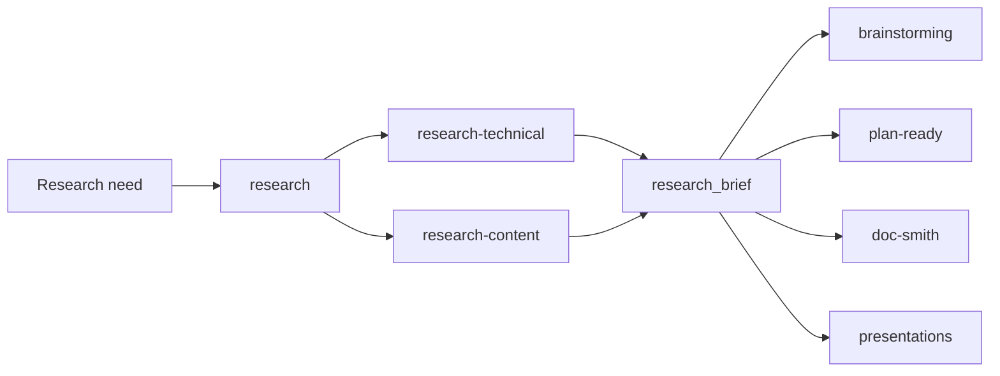

# Research Skill Family Plan

## Goal

Add a small research skill family that grounds work in current credible sources
before downstream brainstorming, planning, writing, or presentation creation.

The first version should create:

- `research`
- `research-technical`
- `research-content`

The family should produce compact research briefs. It should not draft
presentations, write implementation plans, or implement code.

## Motivation

Some work needs external or current-state grounding before design. Examples:

- technical implementation choices need standards, official docs, maintained
  examples, version constraints, security concerns, and known failure modes;
- talks and presentations need current discourse, credible examples, careful
  claims, audience assumptions, and tired framing to avoid;
- broad "research this" prompts need one research lane before they enter
  brainstorming or drafting.

Without a dedicated research step, `brainstorming` either starts from weak facts
or expands into source-gathering and design at the same time. The research
family should separate "what is credible and current?" from "what should we do
with it?"

## Workflow Position



`research` chooses one area skill by default, applies it, and returns that
area skill's evidence brief. Explicit route-only requests still return a
`research_routing` decision. Downstream skills decide what to build, write, or
present.

## Scope

Implement the first usable version:

- Follow `writing-skills` test discipline before shipping the new skills.
- Add `skills/research/SKILL.md`.
- Add `skills/research/agents/openai.yaml`.
- Add `skills/research-technical/SKILL.md`.
- Add `skills/research-technical/agents/openai.yaml`.
- Add `skills/research-content/SKILL.md`.
- Add `skills/research-content/agents/openai.yaml`.
- Add prompt/template fixture support only if needed to keep the shared contract
  visible in tests. Deterministic `research_brief` validation stays deferred
  until real use shows contract drift.
- Add focused tests or fixtures that prove the generated prompts/templates carry
  the routing and `research_brief` contracts.
- Run the repo-managed skill update path for the intended profile and validate
  runtime state.

The first slice must prove two real paths:

1. a technical research request routes to `research-technical` and produces a
   source-backed technical `research_brief`;
2. a presentation or talk research request routes to `research-content` and
   produces a source-backed content `research_brief`.

## Non-Goals

- Do not build a generic deep-research platform.
- Do not add `research-message`, `research-customer`, `research-market`, or
  `research-synthesis` in the first slice.
- Do not create web scraping, crawler, source database, vector index, or
  persistent research state.
- Do not draft talks, decks, DMs, essays, plans, or code inside the research
  skills.
- Do not make `deep` a user-facing mode in v1.
- Do not make research mandatory when the user supplied enough source material
  or when current/external context is unnecessary.

## Implementation Discipline

Follow `writing-skills` validation before writing final skill text:

1. Read `skills/writing-skills/SKILL.md` and the directly relevant
   forward-testing guidance.
2. Define pressure scenarios for the research dispatcher and both area skills.
3. Run baseline prompts without the new skills loaded and capture the failure
   pattern.
4. Write minimal `SKILL.md` files and adapter metadata that address those
   failures.
5. Forward-test the skills with generic prompts that do not leak the intended
   answer:
   - technical: "Research current best practices for building OAuth token
     rotation into a web application. Produce a brief that can feed
     brainstorming.";
   - content: "Research the current landscape for a 20-minute internal
     engineering talk about adopting AI-assisted development workflows. Produce
     a brief that can feed a presentation outline."
6. Record RED/GREEN/REFACTOR evidence in the new skills' test evidence sections
   or a directly linked skill test note.

Do not ship untested process documentation.

## Shared Research Brief

Both area skills should emit a compatible `research_brief`:

```yaml
research_brief:
  status: complete | blocked
  research_type: technical | content
  topic:
  intended_next_step: brainstorming | plan-ready | doc-smith | presentations | other
  freshness:
    checked_at:
    stale_risk: low | medium | high
    current_sources_used: true | false
    evergreen_sources_used: true | false
  source_count:
  sources:
    - id: S1
      title:
      url:
      publisher_or_author:
      published_or_updated:
      accessed_at:
      source_type: standard | official_doc | source_repo | maintained_example | ecosystem_impl | security_ops | primary | discourse | case_study | data | counterpoint | secondary
      why_it_matters:
  primary_sources:
    - S1
  credible_examples:
    - S2
  current_patterns: []
  anti_patterns: []
  constraints_or_implications: []
  evidence_map:
    - claim:
      supported_by:
        - S1
      confidence: low | medium | high
  open_questions: []
  decision_readiness:
    status: ready_for_brainstorming | ready_for_plan_ready | ready_for_doc_smith | ready_for_presentations | blocked
    recommended_next_skill:
    reason:
    missing_decisions: []
  confidence: low | medium | high
```

Every actionable claim in the findings must trace to at least one source in
`evidence_map`. `supported_by` entries must reference stable `sources[].id`
values, not free-form titles.

## Source Target

Use one v1 depth: standard research.

- Aim for 5-10 sources.
- Use fewer than 5 only when the topic is narrow, authoritative sources are
  limited, the user constrains sources, or source access is blocked.
- Use more than 10 only when source conflicts need resolution, multiple viable
  paths require comparison, or the topic is controversial, fast-moving, or high
  risk.

## Research Contract

Use `research` when the user asks to research something without naming a
specific research skill.

Route to `research-technical` when the request is about:

- standards, protocols, APIs, SDKs, libraries, frameworks, architecture,
  implementation patterns, security, performance, deployment, or operations;
- "current best practices" or "reference implementations" for technical work.

Route to `research-content` when the request is about:

- talks, presentations, essays, memos, workshops, public-facing narratives,
  content framing, examples, stats, discourse, or audience assumptions.

If the user invokes `research-technical` or `research-content` directly, skip
the dispatcher.

For normal research requests, `research` chooses one primary area skill, loads
and applies it, and returns that area skill's `research_brief`.

For mixed technical-plus-content requests, choose the primary intent only and
record the deferred secondary lane in `secondary_skill` or equivalent
deferred-lane language. Ask one question when the primary intent is unclear. Do
not run both area skills in v1 unless the user explicitly asks for both.

If research is unnecessary, say so and recommend the next skill.

If routing depends on missing intent, ask one question and stop.

Explicit route-only requests, unclear intent, and unnecessary research use this
output:

```yaml
research_routing:
  status: routed | ask_user | unnecessary
  selected_skill: research-technical | research-content | none
  secondary_skill: research-technical | research-content | none
  reason:
  next_step:
```

## Research Technical Contract

`research-technical` answers: what is the current credible way to implement
this?

### Source Hierarchy

1. Standards and specs.
2. Official vendor, framework, or platform docs.
3. Source repos and maintained examples.
4. Mature ecosystem implementations.
5. Security and operational sources.
6. Secondary/community sources for field evidence only.

### Required Steps

1. Frame the implementation question.
2. Select source lanes from the hierarchy.
3. Collect primary evidence.
4. Extract implementation patterns.
5. Identify anti-patterns and failure modes.
6. Compare viable options.
7. Hand off constraints to brainstorming or planning.

### Technical Fields

Add these fields to the shared brief:

```yaml
version_context:
  language_or_runtime:
  framework_or_sdk:
  provider_platform:
  relevant_versions:
  version_unknowns: []
technical_findings:
  recommended_pattern:
  viable_alternatives: []
  reference_implementations: []
  standards_or_docs: []
  security_considerations: []
  performance_or_operational_limits: []
  verification_implications: []
  deprecated_or_risky_paths: []
  planning_constraints: []
source_conflicts:
  - conflict:
    sources: []
    likely_resolution:
    implementation_risk:
repo_applicability:
  likely_existing_surfaces: []
  integration_constraints: []
  assumptions_to_verify_locally: []
```

`research-technical` should not inspect the repo deeply unless asked. It should
tell the next skill what to inspect locally. Unless the user explicitly
authorizes repo inspection, every `repo_applicability` entry must be framed as
an assumption to verify locally, not as a confirmed local fact.

## Research Content Contract

`research-content` answers: what credible material and framing should inform
this talk, presentation, essay, memo, or workshop?

### Source Hierarchy

1. Primary or canonical sources.
2. Current credible discourse.
3. Concrete examples and case studies.
4. Stats and data points.
5. Counterpoints.
6. Secondary commentary for sentiment or anecdote only.

### Required Steps

1. Frame the content job.
2. Collect sources.
3. Extract useful material.
4. Map the discourse.
5. Identify presentation angles.
6. Hand off to brainstorming, `doc-smith`, or `presentations`.

If audience is missing, ask one question unless the user explicitly wants a
generic landscape brief.

### Content Fields

Add these fields to the shared brief:

```yaml
artifact_type: talk | presentation | essay | memo | workshop | other
audience_context:
  audience:
  role_or_group:
  sophistication_level: low | medium | high | unknown
  likely_beliefs: []
  likely_objections: []
  sensitivities: []
discourse_sources: []
examples_and_case_studies: []
stats_and_data_points: []
counterpoints: []
discourse_map:
  dominant_framing: []
  emerging_framing: []
  disagreements: []
tired_framing:
  - framing:
    why_to_avoid:
    better_alternative:
usable_material:
  examples: []
  stats: []
  references: []
  quote_candidates: []
  analogies_or_stories: []
possible_angles:
  - thesis:
    supporting_evidence: []
    audience_fit:
    risk_or_weakness:
claims:
  strong: []
  plausible: []
  speculative: []
claims_to_handle_carefully: []
```

Do not write the talk, deck, script, or outline inside this skill.
`possible_angles` are research-derived thesis candidates only. They must not
include an ordered outline, slide structure, or narrative sequence.

## Blocked Research States

Return `status: blocked` instead of an under-evidenced brief when:

- current source access is unavailable for a fast-moving technical, security,
  API, SDK, cloud, model/provider, pricing, or platform-support topic;
- current source access is unavailable for content claims about current
  discourse, recent stats, market/category movement, or public sentiment;
- fewer than 5 sources are available and the missing evidence changes the
  decision or claim strength;
- source conflicts cannot be resolved enough to produce a safe downstream
  constraint.

When blocked, include the missing source class and the next concrete lookup or
user input needed.

## Skill Acceptance Criteria

Each new `SKILL.md` must use supported frontmatter only:

```yaml
---
name: research | research-technical | research-content
description: Use when ...
---
```

Requirements:

- `name` must exactly match the skill folder.
- `description` must be trigger-focused and include the relevant use cases.
- Do not summarize the whole workflow in `description`.
- Add `allowed-tools` only if a concrete harness constraint requires it.
- Keep the body concise and procedural.

Each `agents/openai.yaml` file must expose:

```yaml
interface:
  display_name:
  short_description:
  default_prompt:
```

Default prompts must preserve:

- default `research` behavior that returns one selected area skill's
  `research_brief`;
- explicit route-only behavior;
- area-skill brief-only output;
- 5-10 source target;
- stable source IDs and evidence mapping;
- research-vs-drafting and research-vs-planning boundaries;
- downstream handoff recommendations.

## Implementation Slices

### Slice 1: Research And Two Area Skills

Build the narrow end-to-end proof for the research family:

- Create `research`, `research-technical`, and `research-content` skills.
- Create matching `agents/openai.yaml` files.
- Keep `SKILL.md` files concise and trigger-focused.
- Make each skill explicitly stop at a brief or routing decision.
- Include the shared `research_brief` contract in both area skills.
- Include the `research_routing` contract for explicit route-only, unclear, and
  unnecessary `research` outcomes.
- Include source hierarchy and 5-10 source target rules.
- Add test or fixture coverage proving:
  - default technical prompt selects `research-technical` and returns its
    brief;
  - default presentation prompt selects `research-content` and returns its
    brief;
  - explicit route-only prompt emits `research_routing`;
  - mixed-intent prompt chooses one primary skill and records the
    secondary lane or asks one question;
  - route-only contract includes `research_routing.status`, `selected_skill`,
    and `secondary_skill`;
  - technical skill prompt/template includes evidence mapping and technical
    fields;
  - content skill prompt/template includes audience, tired framing, claim
    strength, and content fields.
  - area skill contracts include concrete `research_brief` keys:
    `sources[].id`, `source_count`, `evidence_map[].supported_by`,
    `decision_readiness`, and `confidence`.
- Forward-test the two generic research prompts from the Implementation
  Discipline section and record the result.
- Run skill validation and runtime update/validation.
- Run `pnpm ax skills status --profile personal` and
  `pnpm ax skills status --profile work` after the skills update and record
  whether `ax.lock.json` changed.

#### Acceptance Criteria

- `research` can dispatch a technical request and a presentation request to one
  area skill and return that area skill's brief.
- `research-technical` can produce a source-backed technical brief contract.
- `research-content` can produce a source-backed content brief contract.
- The first slice proves both paths without adding deferred research categories.
- The plan does not require web automation scripts or persistent state.

#### Refactoring / Reuse

- Preparatory refactor: None.
- Reusable surface: Shared `research_brief` schema text duplicated in the two
  area skills for v1.
- First consumer: `research-technical` and `research-content`.
- Later consumers: possible future `research-message`, `research-customer`,
  `research-market`, and `research-synthesis`.
- Behavior-preserving verification: skill validation, adapter prompt checks,
  and focused tests/fixtures for dispatch, route-only, and brief contracts.
- Why this is not premature: the shared brief is consumed by both first-slice
  area skills immediately.

### Slice 2: Optional Validator And Follow-On Research Areas

Only after Slice 1 is used:

- Decide whether a deterministic `research_brief` validator is worth adding.
- Add one next area skill only if real use shows the need:
  - `research-message`;
  - `research-customer`;
  - `research-market`;
  - `research-synthesis`.
- Update research dispatch rules for the new area.

#### Acceptance Criteria

- A real usage gap from Slice 1 justifies the new area or validator.
- The new area uses the same brief contract unless it has a concrete reason not
  to.

#### Refactoring / Reuse

- Preparatory refactor: Extract a shared validator only if Slice 1 usage shows
  contract drift.
- Reusable surface: Optional `research_brief` validator or shared reference.
- First consumer: the next research area or existing area skills.
- Later consumers: the remaining research family.
- Behavior-preserving verification: validator unit tests if added.
- Why this is not premature: deferred until after Slice 1 proves the family.

## Reviewer Selection Expectations

`plan-ready` should select:

- `docs-and-agent-alignment`, because this plan adds reusable workflow skills
  and downstream skill routing expectations.
- `ax-and-skill-compatibility`, because this plan adds skill folders,
  adapter metadata, and runtime-managed skill artifacts.

Baseline reviewers still run:

- `implementation-readiness`
- `edge-cases-and-risks`
- `simplification-and-scope-control`
- `refactoring-opportunities`

## Verification Plan

Expected first-slice verification:

```bash
pnpm exec biome check <touched scripts/tests if any>
pnpm test:unit
pnpm ax skills update --profile personal
pnpm ax skills update --profile work
pnpm ax skills status --profile personal
pnpm ax skills status --profile work
pnpm ax skills validate --profile personal
pnpm ax skills validate --profile work
```

If the broad runtime update path hits unrelated non-symlink instruction targets,
use the narrower profile-scoped `pnpm ax skills update` and validation paths
and report the skipped broader update.

## Open Questions

- None for Slice 1. The first presentation proof should use a generic prompt.
