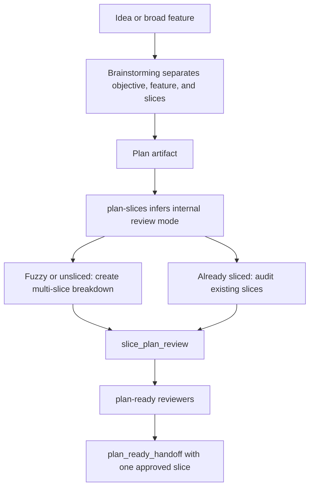

# Skill Slice Steering Plan

## Goal

Make `brainstorming`, `plan-slices`, and `plan-ready` reliably turn broad
feature directions into multiple implementation slices before selecting the
first slice, while keeping validator mode details under the hood.

The user-facing workflow should read as:

1. objective;
2. selected feature;
3. already-shipped context;
4. implementation slices;
5. recommended first slice.

It should not ask the user to choose `create` or `audit`.

## Motivation

Thread `019ed2b5-6e2e-7581-8fc5-e776bde1c1ec` exposed the failure mode. The
agent treated "AI site generation v1" as the first feature slice, then only
converged on "minimal AI usage E2E proof" after repeated correction.

That failure has two causes:

- The brainstorming skill can still let a feature direction stand in for an
  implementation slice.
- The plan-ready flow can expose `mode: create` / `mode: audit` as a concept the
  user has to reason about, even though it should be inferred from the artifact.

## Design Principles

- A roadmap objective is not a feature candidate.
- A feature candidate is not an implementation slice.
- A slice is one PR-sized delivery step with an observable user or system result.
- New or fuzzy plans should be decomposed into multiple implementation slices
  before an approved first slice is chosen.
- Existing plans with concrete slices should be audited, not rewritten by
  default.
- Single-slice plans are allowed only when the work is genuinely atomic and the
  plan records that rationale.
- `create` / `audit` can remain machine-readable validator metadata, but agents
  must infer it and keep it out of normal conversation.

The review YAML should add internal rationale metadata:

```yaml
review_mode_rationale:
  source: created_from_unsliced_artifact | existing_sliced_plan | atomic_change
  reason: <why this internal path was selected>
```

Validator behavior:

- `created_from_unsliced_artifact` requires a multi-slice review with unique
  slice IDs.
- `existing_sliced_plan` may audit existing slices, but a one-slice review still
  has to pass the observable outcome, bounded scope, sequencing, verification,
  refactoring/reuse, and delivery-fit gates.
- `atomic_change` may pass with one slice only when `reason` explains why the
  work cannot be split without inventing fake slices.
- Any one-slice review for a newly sliced artifact whose machine-readable title
  is a broad roadmap feature, v1 objective, platform, or generic foundation must
  be marked blocked and decomposed before plan-ready can continue. Existing
  sliced or explicitly atomic audits use `review_mode_rationale` rather than
  title wording as the machine signal.

## Proposed Flow



## Scope

Update the reusable planning workflow surfaces:

- `skills/brainstorming/SKILL.md`
- `skills/plan-slices/SKILL.md`
- `skills/plan-slices/agents/openai.yaml`
- `skills/plan-slices/scripts/plan-slices.ts`
- `skills/plan-ready/SKILL.md`
- `skills/plan-ready/agents/openai.yaml`
- `skills/plan-ready/scripts/plan-ready.ts`
- related unit tests
- installed runtime copies and `agent-runtime.lock.json`

The existing dirty draft changes in this worktree should be treated as scratch
input. During implementation, either revise them to match this plan or discard
the mismatched portions before committing.

Before implementation starts, inventory the current dirty files and classify
each hunk as plan-approved scratch, plan-doc-only work, or unrelated user work.
Do not discard any hunk without first proving it belongs to the accidental
draft, and verify before commit that the remaining diff matches this plan.

## Non-Goals

- Do not expose `create` / `audit` as a user-facing choice.
- Do not make every genuinely atomic change inflate into artificial slices.
- Do not start implementation delivery from this plan-ready pass.
- Do not create a branch, PR, MR, or hosted review as part of plan readiness.
- Do not commit readiness YAML into this plan file.

## Implementation Slices

### Slice 1: Hidden-Mode Slice Gate

Add the machine-checkable contract that prevents an unsliced feature direction
from validating as one broad first slice.

Observable result:

- A `slice_plan_review` for a fuzzy or newly sliced plan fails when it contains
  only one broad passing slice.
- A `slice_plan_review` with three concrete implementation slices passes.
- A single-slice review can pass only when it is treated as an audit of an
  existing or explicitly atomic plan and includes the internal
  `review_mode_rationale` contract.

Includes:

- Update `skills/plan-slices/scripts/plan-slices.ts` so the validator enforces
  a multi-slice minimum for internally inferred slice creation.
- Add a local helper in `plan-slices.ts` that classifies review metadata and
  centralizes the `review_mode_rationale` checks.
- Keep the `mode` field as machine metadata in YAML, but document that agents
  infer it and never ask the user to choose it.
- Update `plan-ready` handoff templates and fixtures only enough to emit the
  current `slice_plan_review` contract, since `validate-handoff` consumes the
  shared `plan-slices` validator.
- Add or update unit tests for:
  - broad one-slice create review rejected;
  - duplicate slice IDs rejected;
  - multi-slice create review accepted;
  - single-slice audit accepted only with an explicit atomic or existing-slice
    rationale;
  - existing or atomic one-slice audits with broad title wording accepted when
    the rationale is explicit;
  - review template nudges multiple slices without presenting mode as a user
    decision.

Excludes:

- Rewriting the full brainstorming skill.
- Changing plan-ready reviewer selection.
- Runtime profile refresh.

Verification:

- `pnpm exec node --import tsx --test tests/unit/plan-slices-script.test.ts`
- focused Biome check on changed TypeScript files

### Refactoring / Reuse

- Preparatory refactor: keep slice-review parsing helpers small and local to
  `plan-slices.ts`, including one local review-mode classifier for the
  rationale checks.
- Reusable surface: existing `validateSliceReviewInput` export.
- First consumer: `plan-ready` handoff validation.
- Later consumers: `plan-followthrough` and `plan-to-pr` validation can rely on
  reviewed slice IDs remaining precise.
- Behavior-preserving verification: existing stale-fingerprint and gate-status
  tests continue to pass.
- Why this is not premature: the current validator already owns the slice gate,
  so the enforcement belongs there.

### Slice 2: Brainstorming And Plan-Slices Prompt Alignment

Align skill prose so agents consistently produce the user-facing slice breakdown
before selecting slice 1.

Observable result:

- When the user asks for "first feature slice", "different slices", or
  "implementation plan", the model-facing instructions require objective,
  selected feature, shipped context, multiple implementation slices, and a
  recommended first slice.
- The prose explicitly says `create` / `audit` are internal validator metadata,
  not questions for the user.
- Agent entrypoint prompts for `plan-slices` and `plan-ready` carry the same
  hidden-mode behavior as the SKILL.md files.

Includes:

- Update `skills/brainstorming/SKILL.md` with the objective / feature / slice
  distinction and the expected visible output shape.
- Update `skills/plan-slices/SKILL.md` to say agents infer the internal review
  path from artifact shape.
- Update `skills/plan-slices/agents/openai.yaml` so the installed Codex
  entrypoint also says to infer the review path and avoid asking the user for
  mode.
- Update `skills/plan-ready/agents/openai.yaml` so the installed Codex
  entrypoint routes through inferred slice review before handoff validation.
- Add RED/GREEN test evidence for thread
  `019ed2b5-6e2e-7581-8fc5-e776bde1c1ec`.
- Add "broad feature direction as slice" and "asking the user for mode" to the
  common mistakes tables.

Excludes:

- Script validation changes already handled by Slice 1.
- Runtime sync.

Verification:

- Manual doc review against the thread failure mode.
- Concrete regression evidence in tests or skill evidence:
  - one test fixture for a broad one-slice create review rejected;
  - one test fixture for a valid multi-slice review accepted;
  - one SKILL.md Test Evidence entry naming the thread and the desired
    objective / feature / slice separation.
- Focused Biome check on changed files where applicable.

### Refactoring / Reuse

- Preparatory refactor: none.
- Reusable surface: the shared visible output shape can be reused by
  `linear-breakdown` later if needed.
- First consumer: `brainstorming` responses before plan-ready.
- Later consumers: plan-ready and future planning skills.
- Behavior-preserving verification: no behavior-preserving code verification
  needed for prose-only changes; unit tests from Slice 1 remain the enforcement
  layer.
- Why this is not premature: this is the smallest prompt change that targets the
  observed failure.

### Slice 3: Plan-Ready Handoff Integration

Make `plan-ready` consume the hidden-mode slice review without leaking internal
mode selection into normal planning conversation.

Observable result:

- `plan-ready` validates only after a current passing `slice_plan_review` exists.
- The handoff still records reviewed slice IDs and one approved slice.
- The generated handoff template nudges multiple slices for newly created plans
  while leaving `create` / `audit` inside machine-readable YAML only.

Includes:

- Update `skills/plan-ready/SKILL.md` workflow and mistakes sections.
- Update `skills/plan-ready/scripts/plan-ready.ts` handoff template and
  validation behavior as needed.
- Update `tests/unit/plan-ready-script.test.ts` for:
  - reviewed slices matching the slice review;
  - stale slice review rejected;
  - one approved slice selected after multiple reviewed slices;
  - mode metadata not described as user input.

Excludes:

- Plan-followthrough delivery changes.
- Hosted PR/MR review.

Verification:

- `pnpm exec node --import tsx --test tests/unit/plan-ready-script.test.ts`
- `pnpm test`

### Refactoring / Reuse

- Preparatory refactor: keep slice-review validation delegated to
  `plan-slices` exports.
- Reusable surface: existing `sliceIdsFromReviewInput` and
  `validateSliceReviewInput`.
- First consumer: `validate-handoff`.
- Later consumers: `plan-followthrough` handoff intake.
- Behavior-preserving verification: existing plan-ready selection and handoff
  tests continue to pass.
- Why this is not premature: plan-ready already consumes the slice review, so
  reuse avoids duplicating parser logic.

### Slice 4: Runtime Sync And Draft Cleanup

Refresh the installed runtime surfaces and clean up the accidental draft state
before publication.

Observable result:

- Installed `personal` and `work` profiles expose the updated skills.
- `agent-runtime.lock.json` reflects only intended source changes.
- The final diff contains the plan-approved implementation, not abandoned draft
  wording.

Includes:

- Run `pnpm agent-runtime skills update --profile personal`.
- Run `pnpm agent-runtime skills update --profile work`.
- Confirm with `pnpm agent-runtime skills status --profile personal` and
  `pnpm agent-runtime skills status --profile work`.
- Inspect the current dirty-file inventory before editing and record which
  existing hunks are reused or discarded.
- Review `agent-runtime.lock.json` after profile updates and confirm the lock
  diff reflects only intended skill source content for both profiles.
- Report any repo-wide formatting or `mise` gate blockers separately with exact
  command output.

Excludes:

- Creating a PR/MR unless explicitly requested.

Verification:

- runtime status commands for both profiles;
- `git diff -- agent-runtime.lock.json`;
- final changed-file inventory;
- no broad test reruns beyond the implementation closeout checklist.

Delivery expectation:

- After verification, commit the completed implementation and push `main` by
  default.
- If the worktree is detached, land the commit onto `main` before pushing.
- If remote configuration conflicts with repo instructions, stop only long
  enough to correct or explicitly document the primary push target, then push
  `main`.

### Refactoring / Reuse

- Preparatory refactor: none.
- Reusable surface: existing agent-runtime update/status commands.
- First consumer: installed Codex and agent skill surfaces.
- Later consumers: any future plan-ready or brainstorming runs on this machine.
- Behavior-preserving verification: runtime status confirms installed skills are
  resolvable.
- Why this is not premature: shared skill changes are not live until runtime
  copies are refreshed.

## Implementation Closeout Verification

After the approved implementation slice completes, run:

- `pnpm exec node --import tsx --test tests/unit/plan-slices-script.test.ts`
- `pnpm exec node --import tsx --test tests/unit/plan-ready-script.test.ts`
- `pnpm test`
- focused Biome checks on changed TypeScript files
- `mise run check`, or report the exact blocker if `mise` trust or detached
  worktree state prevents the repo gate from running
- `pnpm agent-runtime skills status --profile personal`
- `pnpm agent-runtime skills status --profile work`
- `git diff -- agent-runtime.lock.json`
- final `git status --short --branch`

## Readiness Risks

- The existing dirty draft already changed several source files. Implementation
  must inventory the dirty files, classify each hunk, and verify the final diff
  contains only plan-approved source/runtime changes.
- Repo-wide Biome may report unrelated formatting drift. The implementation
  should separate changed-file verification from unrelated cleanup.
- `mise run check` may be unavailable in detached worktrees if `mise` does not
  trust the local config. The implementation should report that exact blocker
  instead of treating it as a test failure.
- Publication defaults to commit and push `main` after verification. If the
  current checkout or remotes are inconsistent with that default, the
  implementation must correct or document the primary target before pushing.

## Acceptance Criteria

- Agents no longer ask the user to select `create` or `audit`.
- New or fuzzy plans produce multiple implementation slices before selecting an
  approved first slice.
- Existing sliced or truly atomic plans can still be audited without artificial
  slice inflation.
- Single-slice audits require explicit internal `review_mode_rationale`.
- Broad feature directions such as "AI site generation v1" cannot validate as
  the first implementation slice.
- Installed `agents/openai.yaml` entrypoints carry the same hidden-mode behavior
  as the SKILL.md files.
- `plan-ready` emits one approved slice after the full slice list is reviewed.
- Tests prove the validator rejects the single broad-slice regression.
- Completed implementation is committed and pushed to `main` by default after
  verification.
