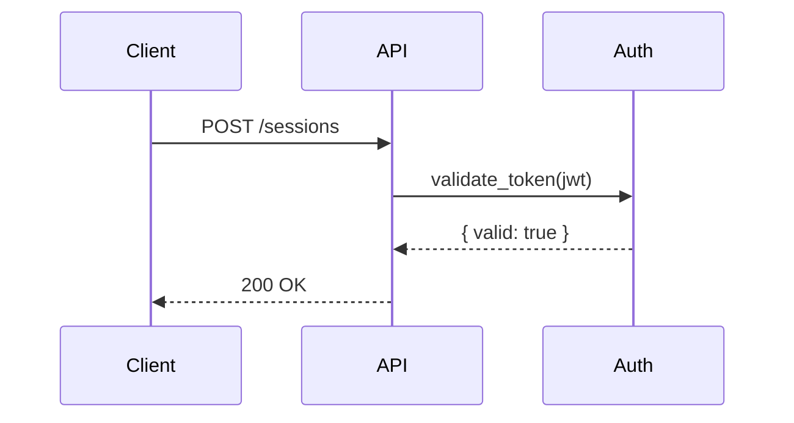

# Formatting Conventions

These conventions apply to all docs produced or reviewed by this skill.

---

## Docusaurus frontmatter

Docusaurus documents must start with a frontmatter block:

```markdown
---
id: feature_flags
title: Feature Flags
sidebar_position: 4
description: How to use feature flags to roll out changes incrementally.
---
```

- `id` — matches the filename without extension (snake_case)
- `title` — human-readable title
- `sidebar_position` — discover from neighboring files with `Glob`; default to the next integer if uncertain
- `description` — under 160 characters; describes what the reader will get

---

## Filenames

Use snake_case: `feature_flags.md`, `local_ssl_setup.md`, `api_authentication.md`.

Never use kebab-case, camelCase, or spaces in doc filenames.

---

## Code blocks

Always include a language identifier:

````markdown
```ruby
User.find(id)
```
````

Never use a bare triple-backtick block without a language.

---

## Diagrams

Mermaid is supported natively in Docusaurus. Use it for:

- Architecture diagrams (`graph TD`)
- Sequence diagrams (`sequenceDiagram`)
- Flow diagrams (`flowchart LR`)
- State machines (`stateDiagram-v2`)

````markdown

````

---

## Tone

- Use imperative mood for instructions: "Run the migration", not "You should run the migration".
- Be direct and concise. Cut anything that does not help the reader.
- No hedging in instructions. State what to do, not what the reader "might want to" do.

---

## Tables

Use tables for:

- Reference material with multiple attributes per item
- Option comparisons
- Enumerated values with descriptions

Do not use tables for prose that flows naturally as paragraphs.

---

## See Also

Add a See Also section when the reader task or repository format requires one:

```markdown
## See Also

- [Feature Flag Admin UI](../admin/feature_flags.md) — manage flags in the dashboard
- [Rollout Strategy Guide](rollout_strategy.md) — decide when to use flags vs direct deploys
```

Use relative markdown links. Do not use absolute URLs for internal docs.

---

## Headings

- No emojis in headings.
- Use sentence case for headings (capitalize only the first word and proper nouns). Exception: `See Also` is title-cased because it functions as a proper section label across the repo.
- H2 for major sections, H3 for subsections, H4 sparingly.
