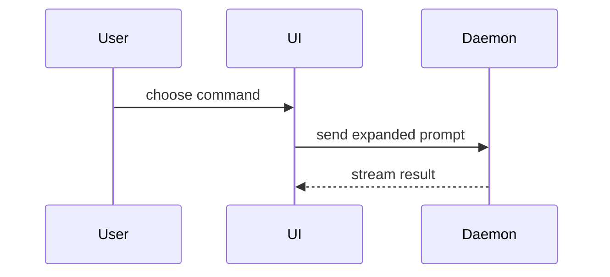

# Sketch examples

Adapt the shape to the current question; these names are illustrative.

## Proposed logic change

```diff
 on(save)
-  write content
+  if content is unchanged
+    return cached result
+  write content
+  update cache
+  return fresh result
```

## Runtime call tree

```text
submitForm
  createSession
    persistPrompt
    launchAgent
  navigateToSession
```

## Component ownership

```tsx
<SessionPage> (apps/example/src/routes/session.tsx)
  useSessionEvents()
  <SessionToolbar>
    <RunSkillButton> (packages/ui)
```

## File responsibilities

```text
src/
├── commands/       # parses user actions
├── sessions/       # owns session state
└── transport/      # sends API requests
```

## Interaction



## Complete target shape

```ts
function expandSkill(command: string): string {
  const skillName = command.slice(1);
  return `use the ${skillName} skill`;
}
```
